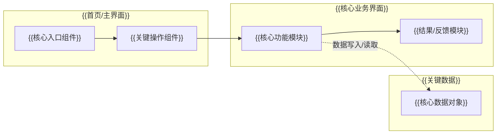

# PRD 模板

最终 `prd.md` 必须与下述格式完全一致。只替换占位符；不要增删、改名或重排章节。

````markdown
产品名称: {{产品名称}}
Slogan: {{一句话标语}}
工具形态: {{第 1 题选项答案}}

【用户画像】
{{具体用户画像。必须是一段自然语言，包含姓名、年龄、身份、日常处境、痛点和动机。}}

【场景故事】
场景一：{{具体时间/地点/触发事件，用户打开产品并完成一个核心动作，得到明确改善。}}
场景二：{{另一个具体场景，体现不同但相关的使用需求。}}

【核心功能 MVP】
- {{功能名}}：{{功能说明}}
- {{功能名}}：{{功能说明}}
- {{功能名}}：{{功能说明}}
- {{功能名}}：{{功能说明}}

【交互流程】
- {{步骤1}}
- {{步骤2}}
- {{步骤3}}
- {{步骤4}}

【Mermaid 流程图】

````

## 精确性规则

- 第一行必须以 `产品名称:` 开头。
- 第二行必须以 `Slogan:` 开头。
- 第三行必须以 `工具形态:` 开头，且内容直接使用第 1 题选项答案。
- `工具形态:` 必须位于 `Slogan:` 和 `【用户画像】` 之间。
- 文档内容必须继承六道题的递进选择结果；不要把未选用户、未选痛点、未选场景或未选功能写成 MVP 主线。
- 如果第 1 题选择了明确工具形态，用户画像、场景故事、交互流程和 Mermaid 都必须体现对应平台入口与能力边界。
- 章节标题必须与下列文字完全一致：
  - `【用户画像】`
  - `【场景故事】`
  - `【核心功能 MVP】`
  - `【交互流程】`
  - `【Mermaid 流程图】`
- 不要在文首添加 Markdown 总标题。
- 不要使用分割线（horizontal rules）。
- 不要在文末加说明。
- 生成后关于「可上传参考图生成设计系统」的提示只能出现在对话中，不要写入 `prd.md`。
- Mermaid 必须放在 `【Mermaid 流程图】` 下方的 Mermaid 代码围栏中，围栏开始行为 ```` ```mermaid ````，结束行为 ```` ``` ````。
- Mermaid 使用 `flowchart LR` 或 `flowchart TD`。
- Mermaid 必须使用 `subgraph` 表达核心界面/页面及其内部关键组件或功能模块。
- Mermaid 只包含产品架构分析中优先级评分为 4 分及以上的核心模块。
- Mermaid 要清晰标注用户操作路径和关键数据流向。
- Mermaid 图保持有效且简洁。

## 可选 UI 设计风格

只有当基础版 `prd.md` 已生成，且用户上传了设计参考图或明确要求把设计系统写入 PRD 时，才允许在 `【Mermaid 流程图】` 之后追加以下章节。否则不要添加。

```text

【UI 设计风格】
## 设计系统
### 设计风格
{{基于参考图提炼的视觉调性}}
### 颜色系统
{{主色、辅助色、功能色}}
### 组件样式
{{按钮、卡片、输入框等组件外观}}
### 圆角边框
{{圆角半径与边框规律}}
### 阴影效果
{{投影、光感、层级}}
### 图标风格
{{图标线性/面性/粗细/应用规范}}
```

可选章节规则：

- `【UI 设计风格】` 必须追加在全文末尾。
- 设计系统正文控制在 200 字以内。
- 不要为了设计系统修改前面的 PRD 章节标题。
- 不要为了等待图片而推迟基础版 `prd.md` 的生成。
- 没有图片或用户明确跳过时，不要输出该章节。
