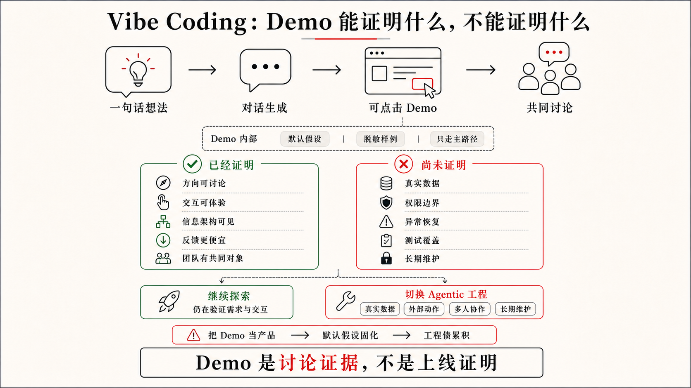
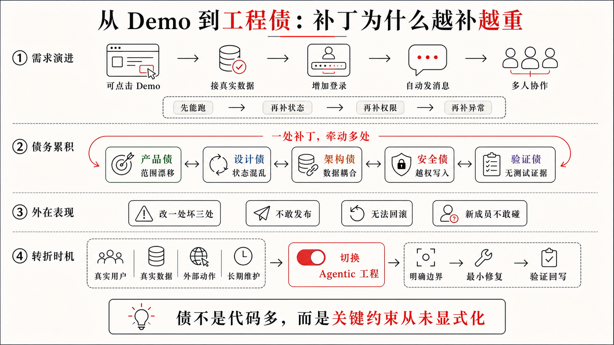

## 1.1 Vibe Coding 的价值和边界

一支三五人的销售团队，往往要同时应对好几件让人头疼的事：线索从表单、社群、活动、转介绍和私信里进来，渠道各不相同；客户沟通散在邮件、电话纪要和聊天记录里，没有统一的地方汇总。销售成员想知道客户到底提过什么需求；负责人想看到哪些机会正在变冷、下一步该重点跟谁；管理层想了解整体进展，不只靠口头汇报；而每个人都担心：哪些承诺不能随便说出口，哪些内容不能直接发给客户。于是，一个很自然的念头出现了：能不能做一个轻量 CRM，让 AI 帮忙整理线索、总结需求、提示风险，并给出下一步跟进建议？

今天我们来一起做一个 CRM 工具，作者会把这个工具命名为 LeadFlow。它的第一版听起来并不复杂：导入销售线索和客户沟通记录，展示客户详情，让 AI 基于已有记录生成总结和建议。但只要稍微往真实使用靠近一步，问题就会变得尖锐：客户没有提预算时，AI 能不能猜；AI 建议看起来很确定时，你会不会把它当成客户承诺；手机号、邮箱和合同金额能不能进入日志；一条建议被生成、被确认、被执行、被对外发送，界面上该不该是同一种状态。

在定义 Agentic Coding 之前，先看更常见的起点。很多人第一次认真体验 AI 编程，不是从工程规则开始，而是从一个很自然的愿望开始：我有一个想法，我想马上看见它。Vibe Coding 正是把这个愿望变成软件原型的一种方式。

### Vibe Coding 的价值：先让想法跑起来

2025 年 2 月，Andrej Karpathy 用 “Vibe Coding” 描述了一种新的编程体验：人主要用自然语言提出要求，接受 AI 的修改，遇到错误就把错误继续交给 AI，有时甚至暂时不再关注代码本身。这个词后来被更宽泛地使用，用来指代那种凭直觉、语言和感觉推动 AI 生成软件的过程。它最适合周末实验、一次性工具、早期原型和产品方向探索。

在 LeadFlow 的起点上，Vibe Coding 式的请求通常非常直接，例如你可以在 Google 的 AI Studio 上这样对 Gemini 说：

```text
帮我做一个销售线索管理工具，可以导入客户线索，AI 自动总结客户需求，并给出下一步跟进建议。
```

几分钟后，一个页面出现了。左边是线索列表，右边是客户详情，中间有客户来源、跟进阶段、AI 总结、意向评分和下一步建议。它能点击，能切换状态，甚至还能生成一段像销售助理写出的跟进建议。



图 1-1 LeadFlow 第一版 Vibe Demo 界面

过去，一个想法要变成可点击的软件，需要产品草图、设计稿、技术选型、页面结构、数据模型、前后端实现和一堆调试。现在，你只要把感觉说出来，AI 就能把它变成一个看得见、摸得着、能继续讨论的东西。

Vibe Coding 降低的是软件表达的门槛。人不必先证明自己会写代码，才能开始表达自己想要的软件；团队也不必在第一天就把所有需求、边界和架构想清楚，才能判断这个方向有没有价值。对 LeadFlow 这种还在探索阶段的产品来说，先看到一个 Demo，往往比先写二十页需求文档更有效。

这也是为什么我很愿意承认 Vibe Coding 的价值。它特别适合做自己的工具：一个内部脚本、一个内容整理器、一个临时看板、一个只服务自己的自动化流程。你知道它的数据从哪里来，知道哪里只是临时拼的，知道坏了以后自己能不能接受。这个阶段的目标不是商业级交付，而是让想法出现、让自己用起来、让问题变得可讨论。

但这个边界也要说清楚。个人工具可以靠开发者自己的记忆和容忍度维持，但 LeadFlow 从第一天起就要承接真实线索、真实销售动作、客户隐私和对外承诺，它不能只靠“看起来能用”推进。Vibe Coding 可以帮你把工具做出来，但它默认不会替你建立需求边界、设计状态、权限策略、验收证据和长期维护秩序。

### Demo 之后，工程债开始浮出水面

你看完 LeadFlow 的 Demo，觉得方向对了，于是开始补充更真实的要求：

```text
AI 总结必须基于真实沟通记录。
客户没有提预算时不要猜预算。
下一步建议要先由销售确认，不能自动对客户承诺。
客户手机号、邮箱和合同金额不能进日志。
页面要清楚区分“AI 建议”“销售已确认”和“已对外承诺”。
后面可能还要接真实 CRM 和团队权限。
```

这时，LeadFlow 可能开始暴露一些你在意的问题：AI 总结到底来自哪条沟通记录，还是模型凭常识补全？意向评分是基于客户行为、销售阶段，还是一个好看的数字？“建议下周发送报价”是一条销售草稿，还是系统已经默认可以对客户发出承诺？如果客户资料缺少关键字段，界面是提示“信息不足”，还是继续显示一段看似确定的建议？

如果说上面这些疑问关心的是“输出能不能信”，那么继续让 AI 修改，还会带来另一类问题：代码内部正在变乱。它确实还能继续生成代码，可以加一个来源标签，也可以补一个“确认建议”按钮，还可以再接一个“导入 CRM”的入口。每一小步看起来都在前进，但代码内部可能已经出现了三套线索结构、两套阶段判断、一组没人再使用的假数据，以及一堆只为让页面跑起来而临时拼上的状态。

输出不可信、结构在变乱，这两类问题合起来，就是 AI 时代的工程债。它不是因为某一行代码看起来不够漂亮，而是因为每一轮生成都在局部补洞，却没有一个稳定的工程结构承接这些洞。需求边界没有稳定，设计状态没有定义，架构理由没有留下，隐私和权限没有进入约束，验收和安全检查被拖到以后，代码为什么这样组织也没有人能解释清楚。



所以，Demo 阶段只需要证明“这个方向看起来成立”，但真实工程需要回答另一组问题：导入失败、无沟通记录、模型调用失败时系统如何表现；哪些客户信息可以进入 AI 分析，哪些字段必须脱敏；线索导入、阶段判断、AI 总结、建议确认和页面状态之间有没有清楚边界；AI 建议是否真的有来源，确认前是否不会被标为已执行，隐私字段是否没有泄露。

这些问题不会因为 AI 继续生成而自然消失，反而会越积越高。生成速度越快，这些没有被接住的债务就堆得越多，直到某一天团队发现软件已经“看起来很完整”，却越来越不敢改。

代码规模会把这个问题放大。几百行、几千行的个人工具，即使结构粗糙，人也可能靠记忆和搜索把它修回来；一旦项目进入数万行级别，尤其超过三万行代码以后，真正困难的就不再是“AI 能不能继续写”，而是人和 AI 是否还能共同理解哪些结构是当前有效的，哪些路径已经废弃，哪些行为不能破坏，哪些测试和页面结果才说明改动可信。三万行不是一个科学分界线，而是作者认为的一个工程经验上的警戒线：当代码已经大到不能靠感觉通盘掌握时，继续用不审核代码、不维护上下文、不沉淀验收的方式推进，控制力会明显下降。

### 中间过程不透明，风险被推到最后

Vibe Coding 还有一个容易被忽略的问题：中间过程经常不透明。人看到的是一个能跑的页面、一段顺畅的回答、一个看起来更智能的交互，但很难知道 AI 在中间补了哪些假设、绕过了哪些失败、修改了哪些无关文件，又把哪些风险藏进了默认行为里。

对 CRM 工具来说，这种不透明尤其危险。AI 可能为了让建议看起来完整，默认补出客户预算；为了让页面不报错，继续显示示例客户；为了让日志方便调试，把手机号和邮箱一起打印出来；为了让状态流转顺畅，把“销售已确认”和“已对外承诺”混成同一个字段。界面越像一个成熟产品，这些中间假设越容易被误认为已经经过设计和验证。

人如果只在最后看结果，就只能做一种粗粒度判断：这个页面感觉对不对。可是工程风险往往发生在结果形成的过程中：AI 读了哪些上下文，依据了哪份规则，选择了哪条实现路径，跑了哪些检查，失败时怎么处理，越过边界时有没有停下来请求确认？只看最后的结果，这些问题都无从回答，人的控制就会退化成事后猜测。

这也是很多团队在 AI 编程里感到不安的原因。问题不只是“AI 会不会写错代码”，而是“我不知道它为了得到这个结果到底做了什么”。当过程看不见，团队 Review 时就只能盯着最终页面和最终 diff，这时候很难判断哪些风险已经被覆盖，哪些风险只是暂时没有暴露。

### 缺的不是更多生成，而是承接结构

把前面的两个问题放在一起看，真正危险的地方就清楚了：一边是工程债在增加，一边是中间过程看不见。继续让 AI “再生成一点”当然还能推动页面变完整，但它不能自动回答建议基于什么、状态如何流转、哪些信息不能泄露、哪些检查已经做过、哪些风险应该停下来让人判断。

如果你想解决这个问题，你缺的不是一个更聪明的补全动作，而是一套能承接 AI 执行的工程结构。它要把目标、上下文、设计约束、边界、权限、验收、反馈和回写组织起来，让 AI 的行动不再只靠当下对话里的感觉，而是进入一个可观察、可限制、可验证的工作过程。后面我们会把这种承接结构称为 Harness 工程。

Harness 工程可以先理解成“把 AI 的能力接进工程现场的那套结构”。在这套结构里，模型负责理解和生成，工具负责读写、命令、浏览器和外部连接，规则给出长期约束，权限和审批划定影响范围，验收标准定义什么时候算做完，测试、日志、截图和 diff 则把结果变成可核对的证据。没有这套结构，AI 仍然能生成代码，但每一轮都像在临场发挥；有了它，AI 才能在边界内持续行动，并把结果交回给人审查。

把这套承接结构建起来、让 AI 真正在里面工作，正是 Agentic Coding 要做的事。它不是否定 Vibe Coding，而是在方向初步成立之后，把软件修改放回真实工程环境里，让 Codex 这类 Coding Agent 在目标、上下文、设计约束、边界、权限和验收标准内完成一轮可检查的工程任务。

读到这里，你可能会有一个担心：既然这套承接结构要管目标、上下文、设计约束、边界、权限和验收，那是不是意味着，我以后让 AI 做事，每次都得先把这一长串东西写成规范，才能开始？

恰恰相反。承接结构的意义，就是把这些长期约束从每一次对话里搬出去，沉淀进项目本身。所以在真实项目里，人提需求往往还是一句话，甚至更短。同样是做 LeadFlow，你说出口的可能仍然是：

```text
帮我做一个销售线索管理工具，要有 AI 总结和跟进建议。
```

区别不在这句话有多长，而在它背后有没有那套承接结构。约束越早沉淀进项目，人需要在当下说清的细节反而越少，系统即使只听到一句话也能接住；同一句话进入系统后，是被直接当成生成指令，还是先被项目上下文解释、校准，再变成可验证、可交接的状态，正是后面两节要展开的事。

Vibe Coding 让想法更快出现，Agentic Coding 让已经出现的方向进入真实工程。理解这一点之后，下一节才适合正式定义 Agentic Coding：它到底委托给 AI 什么，又要求人把哪些控制点提前放进系统里。
