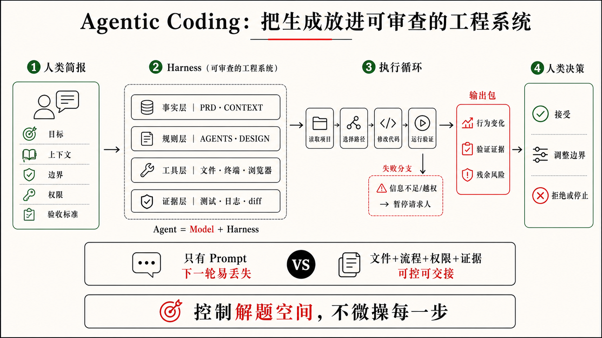

## 1.2 Agentic Coding 的定义

上一节的结尾已经把话题带到 Agentic Coding 的门口：Vibe Coding 能很快把 CRM 这样的想法变成可见的 Demo，但 Demo 之后真正缺的，是一套能承接 AI 执行的工程结构，也就是 Harness；让 AI 真正在这套结构里工作，就是 Agentic Coding。问题是，“在承接结构里工作”还只是一个轮廓。它没有说清楚：人到底交出什么，AI 又在什么条件下完成什么、对什么负责。

所以，定义 Agentic Coding 时，不能只看“人怎样提示 AI”。真正要看的，是 AI 在什么工作系统里写代码。在这本书里，作者认为 Agentic Coding 可以这样定义：

> 人用目标、上下文、设计约束、边界、权限、规则和验收标准发起工程委托；Coding Agent 在一套内置的 Harness 工程底座中读取项目、选择路径、修改代码、运行验证、修复失败，并把证据和风险交还给人判断。



图 1-2 Agentic Coding 的定义

这个定义故意把“写代码”放在中间，而不是放在全部。真实项目里，一次代码变更还要面对现有架构、历史代码、运行环境、设计状态、团队规则、权限边界、测试证据和验收标准。Agentic Coding 要解决的，不是让 AI 生成更多代码，而是让 AI 生成的代码被一套工程系统约束，最后更接近人的真实需求。

这里可以借用一个更直观的公式：

```text
Agent = Model + Harness
```

模型当然重要，它提供理解、推理和生成能力。但在真实工程里，模型不是整个系统。指令、规则、上下文、工具、沙箱、审批、Hooks、Skills、测试、日志、diff、可观测性和人的 Review，才共同决定这个模型能不能把一件事做完、做对、做得可审查。Google 的一份 AI 工程 playbook 《The New SDLC With Vibe Coding》 里用“模型只占 10%”来提醒团队不要把所有成败都归因于模型强弱。这个比例不必被理解成精确数字，它真正有价值的地方在于指出：团队最能控制、最应该投入的，往往是模型周围那套 Harness。

### 核心变化不是提示词变长

上面这个定义一口气列了目标、上下文、设计约束、边界、权限、规则和验收标准。只看这串清单，很容易以为 Agentic Coding 就是把它们整理成一段更完整的 Prompt：

```text
目标是什么？
上下文是什么？
限制是什么？
完成标准是什么？
```

这些当然有用。一个清楚的任务表达，永远比一句“帮我做得更智能”可靠。但如果 Agentic Coding 只停留在这几行提示词，它很快会遇到上限。

因为 Prompt 是一次性的。它只能在当前对话里提醒 AI：这次要注意什么。可真实项目里的很多要求不是一次性的，比如 CRM 里“AI 建议必须带来源”“不能编造客户预算”“手机号和邮箱不能进日志”“销售确认前不能标为已执行”。这些要求如果每次都靠人临时输入，迟早会漏掉。

Agentic Coding 的关键，是把这类判断从临时对话里移出来，放进 AI 能持续读取、执行和回写的系统里，例如：

把一次性任务留在 Prompt 或 `TODO.md` 里；把长期工作协议放进 `AGENTS.md`；当前可信事实进入 `CONTEXT.md`；产品目标、非目标和成功现象进入 `PRD.md`；视觉 Token、UI 技术栈、组件策略、界面流程、状态和风险表达进入 `DESIGN.md`；什么结果可以接受，进入 `ACCEPTANCE.md`；重复出现的工作流，可以做成 Skill；别人已经封装好的成熟流程，也可以作为 Skill 下载、安装和复用；需要连接外部工具，可以用 MCP；需要在生命周期里自动检查，可以用 Hook；需要团队分发，就可以进一步打包成 Plugin 等等。

这时，AI 写代码时面对的就不再只是一段自然语言，而是一组可以共同约束它行动的工程对象。

### Codex 已经内置了一套成熟框架

这也是为什么本书会以 Codex 为主要样本。Codex 不是一个只会回答问题的代码模型。OpenAI 当前文档把 Codex 定位为面向软件开发的 Coding Agent：它可以写代码，理解陌生代码库，审查代码，调试修复问题，并自动化一部分开发任务。更重要的是，Codex 已经把 Agentic Coding 需要的几层能力组织在一起。

可以把 Codex 的内置框架粗略理解成这样：

```text
项目规则和上下文
→ 任务路由与策略判断
→ 文件、终端、浏览器、MCP 等工具执行
→ 沙箱与审批边界
→ Skills / Plugins / Hooks 等可复用机制
→ 测试、日志、截图、diff 和最终汇报
→ 人的反馈、Review 和最终验收
```

这套框架让 Codex 进入项目时不是空手猜测。它会读取项目规则，例如官方文档建议放在 `AGENTS.md` 里的仓库结构、常用命令、工程约束、完成标准和禁区。它能根据任务判断自己应该答疑、改代码、调试、查文档、跑验证，还是请求授权。它可以读文件、搜索代码、执行命令、编辑文件、查看 diff、操作浏览器，并把失败结果带回下一轮判断。它的自主性也被沙箱和审批限制：在已授权范围内可以连续推进，触碰网络、越界文件、危险命令或高风险动作时必须停下来请求确认。

所以，当一次 AI 编程结果不理想时，第一反应不应该只是“换个更强模型”。模型可能确实不够强，但很多失败其实来自 Harness：规则太虚，验收太粗，上下文过期，工具不可用，沙箱和权限没有设计好，或者没有留下可复查的验证证据。Agentic Coding 的工程性，就体现在这些可调整、可审查、可沉淀的部分上。

2026 年，Karpathy 在与 Stephanie Zhan 的一场对谈里，把话题从 Vibe Coding 推向 Agentic Engineering。这个转向背后的判断很重要：当 AI 生成代码的能力已经足够强，真正的瓶颈就不再只是“能不能写出来”，而是“怎样设计一套 AI 可以持续参与、可观察、可验证、可审批、可回写的系统”。

从这个角度看，Codex 已经提供了一套可直接使用的 Agentic Engineering 底座，也就是上一节说的那种承接 AI 执行的 Harness 工程。你不必第一天就自己发明工作区、工具调用、权限审批、Skills、MCP、Hooks、验证和 Review 机制。你可以先站在 Codex 这套现成底座上，把自己的目标、项目规则、业务约束和验收标准放进去。

### 文件约束代码质量

Agentic Coding 的一个核心动作，是把“你希望 AI 怎么写代码”外部化，让产品判断、架构偏好和风险边界在实现之前就写进项目，而不是留给 AI 在补空白时临场决定。AI 补出来的常常能跑、也像回事，却不一定是你想要的那条路。如果你只说：

```text
帮我接入 AI 跟进建议。
```

AI 可能真的会做出一个建议卡片。它可能顺手接入模型 API，也可能加一个“发送给客户”的按钮，还可能为了让页面看起来完整，在没有沟通记录时显示一段通用销售话术。页面会变丰富，但代码质量和产品风险不一定更好。

换成 Agentic Coding，约束不再集中在一段 Prompt 里，而是更早进入系统的不同文件。比如，同样是“做 AI 下一步跟进建议”，它在项目里可能被拆成这样：

```text
PRD.md
- 产品目标：帮助销售基于真实沟通记录判断下一步跟进，而不是让 AI 生成听起来专业的话术。
- 成功现象：销售能在客户详情页看到可追溯的 AI 建议，并在确认后决定是否执行。
- 非目标：不做完整 CRM，不做自动外呼 / 自动邮件，不让 AI 直接对客户作出承诺。

CONTEXT.md
- 当前版本只使用脱敏样例线索和沟通记录。
- 当前沟通记录支持 leadId、channel、timestamp、author、body 等字段。
- 当前来源粒度是沟通记录级，真实 CRM 同步尚未启用。
- 旧静态建议文案不再作为当前产品事实。

DESIGN.md
- 设计系统方向：轻量 CRM 后台，信息密度高于营销页，界面应克制、清晰、便于扫描。
- 视觉 token：主色、表面色、正文色、间距、圆角、字号和行高使用统一 token，不在组件里随意写死。
- UI 技术栈：Tailwind + CSS variables，图标库统一使用 lucide-react，复杂弹层和下拉遵循同一组件策略。
- 客户事实、AI 建议和销售确认必须在界面上分区展示。
- AI 建议卡片默认是 draft / waiting for confirmation 状态。
- 来源入口必须靠近建议正文，方便销售展开复查。
- 无沟通记录时显示信息不足状态，不展示通用销售话术。
- MVP 主按钮是“确认为跟进计划”，不是“发送给客户”。

AGENTS.md
- 默认使用脱敏样例数据，真实客户数据、真实 CRM、外部模型调用和自动发送能力都需要明确授权。
- 不得把手机号、邮箱、合同金额、授权信息或完整客户原文写入日志。
- AI 建议相关改动必须保留来源、确认状态和隐私边界。
- 交付时说明行为变化、验证证据、未验证项和残余风险。

TODO.md
- [ ] 客户详情页展示 AI 下一步建议
  - 依赖：当前线索有可读取的沟通记录。
  - 设计：见 `DESIGN.md#AI-Suggestion-Card`
  - 验收：见 `ACCEPTANCE.md#AI建议必须显示来源`
  - 状态：未开始
- [ ] 无沟通记录时显示信息不足
  - 验收：见 `ACCEPTANCE.md#沟通记录不足时不生成建议`
  - 状态：未开始

ACCEPTANCE.md
- Given 某条线索有沟通记录，When 系统生成下一步建议，Then 建议必须关联来源记录并允许展开查看。
- Given 某条线索没有沟通记录，When 用户查看 AI 建议区域，Then 页面显示信息不足，不生成客户需求或预算判断。
- Given 销售尚未确认建议，When 页面展示建议状态，Then 建议不得出现在已执行跟进记录中。
```

这些内容不一定要在第一天全部写满，也不一定每个项目都照抄这六个文件，但是它们是关键：目标、事实、设计系统、长期规则、当前任务和验收标准被放到了不同位置，各自承担不同职责。它们不是一段被拆行的 Prompt，而是项目系统的一部分。

这里没有规定 Codex 先改哪个文件、后写哪个函数。人控制的不是每一步操作，而是解题空间。Codex 仍然可以自己读取代码、判断现有结构、选择实现路径和运行验证；但它的选择会被这些文件里的目标、事实、设计系统、规则、任务状态和验收场景约束。

这就是 `AGENTS.md`、`TODO.md`、`ACCEPTANCE.md` 等文件的意义。它们不是文档洁癖，而是把代码质量要求变成 AI 可以读取的工程条件。没有这些外部状态，质量只能靠人最后 Review 时发现问题；有了这些状态，质量可以提前进入 AI 的执行过程。

### Skills 让经验可以被复用

文件主要承载项目状态和长期规则。Skills 承载的是另一类东西：一套可复用的工作流。

如果你每次都对 AI 说：

```text
做 UI 改动前先看设计约束；
启动页面后检查桌面和移动端；
截图看有没有重叠和溢出；
改完后说明视觉验证结果。
```

这就不应该永远停留在 Prompt 里。它可以变成一个 UI 验收 Skill。以后遇到类似任务，Codex 只要判断任务匹配这个 Skill，就能读取完整流程、参考资料和脚本。

更重要的是，Skill 不只来自你自己。Codex 支持系统内置 Skill、用户本地 Skill、仓库 Skill，也可以通过安装器或插件使用别人已经写好的 Skill。换句话说，Agentic Coding 的经验来源可以是个人踩坑后的沉淀，也可以是团队共享的流程，还可以是社区或第三方已经封装好的成熟做法。

这会改变 AI 编程的学习方式。过去，你要把所有经验都写进自己的提示词；现在，你可以把一部分经验安装进工作环境，让 Codex 在合适任务里按需加载。Skill 不是更长的 Prompt，而是别人或自己沉淀下来的可复用经验。

当然，Skill 也不是越多越好。一个坏 Skill 会把过期流程变成新的噪音，一个太重的 Skill 会让小任务背上不必要的流程成本。判断一个 Skill 是否值得使用，仍然要回到任务风险：它是否减少重复解释，是否提高质量，是否让验收更清楚，是否让 Codex 少走错路。

### 验收让结果合你的需求

最后，Agentic Coding 必须用验收收口。AI 写出代码、页面能打开、测试变绿，都只说明某个动作发生过，并不说明这次结果符合人的需求、覆盖了关键风险。所以在开发 LeadFlow 的时候，“AI 跟进建议做完了”不是一个合格的完成标准；“建议必须带来源、确认前不得标为已执行、手机号和邮箱不进日志，并说清未验证项”，才更接近 Agentic Coding 的完成。

这些验收条件会反过来约束 Codex 的实现：建议卡片做出来但没有来源，它不该停；隐私日志没有检查，它应该说明证据缺口；测试无法运行，它不能把“没跑”包装成“通过”。完成信号为什么不能只靠感觉、验收强度又如何匹配风险，后面会专门展开；这里只需先记住一点：验收是定义的一部分，不是事后追加的环节。

从这个角度看，Agentic Coding 的核心不是让 AI 更自由，而是让 AI 的自由发生在可检查的边界内。Codex 负责读取、实现、验证、修复和汇报；人负责定义目标、边界、规则、权限、验收和最终责任。

第一章先把定义讲到这里：Vibe Coding 让想法出现，Agentic Coding 借助 Codex 这样的成熟框架，把想法放进目标、文件、Skills、权限和验收组成的工程系统里，让一轮代码变化可控、可验、可交接。下一节把两者正面摆在一起比较：你会看到，它们的差别不在谁更高级，而在同样一句话交给系统之后，谁还在维护那个可以继续解释、验证和交接的解题空间。
