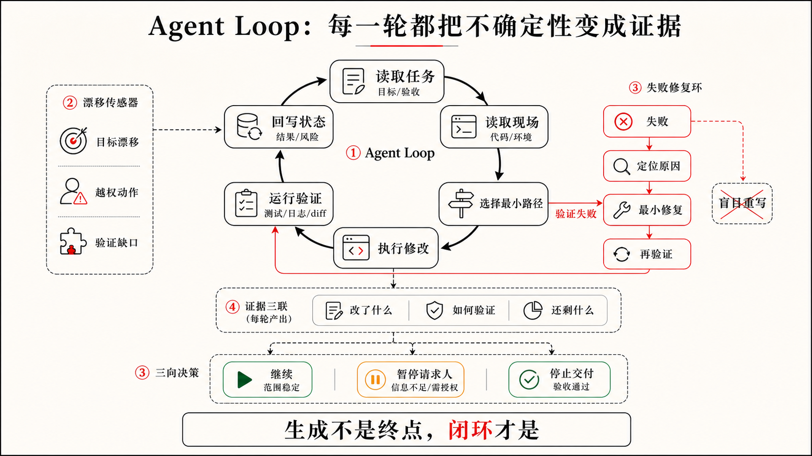

## 1.4 Agentic Coding 解决了什么问题？

前面三节已经把边界讲清楚了：Vibe Coding 让想法快速出现，Agentic Coding 让一句自然语言需求进入项目上下文、设计系统、规则、权限和验收组成的工程系统。现在可以进一步回答一个更直接的问题：既然 AI 已经能写代码，为什么还需要 Agentic Coding？

它解决的不是“代码由谁敲出来”这种问题。AI 生成代码已经足够快，很多时候快到让人来不及判断。真正的问题在后面：Demo 之后变化能不能被接住，五类工程债会不会不断后移，代码规模扩大后还能不能控制，Agent Loop 跑久以后会不会漂移，完成信号是否可信，开发成本是否可控，AI 的自主性是否真的可以委托。这些问题合在一起，才是 Agentic Coding 的问题域。

### 它解决 Demo 之后没人接住变化的问题

AI 编程最容易让人误判的地方，不是它生成得不够像，而是它生成得太像了。你说“帮我做一个销售线索管理工具，可以导入客户线索，AI 自动总结客户需求，并给出下一步跟进建议”，几分钟后 LeadFlow 的 Demo 就出现了。左边是线索列表，右边是客户详情，中间有 AI 总结、意向评分和下一步建议，按钮也能点。

这个时刻很有价值。它让一个模糊想法变得可见，也让产品经理、设计师、销售和工程师可以讨论方向。但 Demo 回答的是“这个方向看起来成立吗”，真实工程回答的是另一组问题：AI 总结是否基于真实沟通记录，客户没有提预算时会不会被编造预算，下一步建议是销售草稿还是对外承诺，手机号和邮箱会不会进入日志，无沟通记录、字段缺失、AI 分析失败时界面如何表现，后续接真实 CRM、团队权限和发布流程时系统还能不能继续改。

这两组问题都重要，但不是同一组问题。Demo 证明方向，不证明边界。真实工程的标志也不是代码量变大，而是系统开始承担后果：销售会相信建议，负责人会根据阶段看机会，客户信息可能包含隐私，后续修改会影响已有行为，别人也可能接手维护。

第二轮需求最容易暴露第一轮债务。你让 AI 加来源引用，才发现建议没有和沟通记录绑定；让它加人工确认，才发现界面只有一个看起来很确定的建议卡片；让它加隐私边界，才发现客户原文、手机号和邮箱可能混在日志里；让它接真实 CRM，才发现线索导入、去重、阶段判断和跟进状态各走一套临时逻辑。

所以，Agentic Coding 解决的第一类问题，是让 Demo 找到的方向进入一个能承接变化的工程结构。它不要求每个原型都马上变成严肃项目，也不否定快速探索。它只是在原型开始面对真实数据、真实用户、团队协作、长期维护或外部交付时，提醒我们换一种完成标准。

这套完成标准不是：

```text
AI 已经生成了一堆代码。
```

而是：

```text
目标、设计、边界、权限和验收已经清楚；
实现进入了现有工程；
关键风险有证据；
未验证项和残余风险被说明；
下一轮修改能从当前状态继续。
```

### 它解决五类债后移的问题

从 Demo 到可交付产品，最容易犯的错误，是继续让 AI 生成更多功能。多一个按钮、多一个页面、多一个导入入口、多一个 AI 建议选项，都会让项目看起来更完整。但如果底层问题没有补上，功能越多，后面的维护压力越大。

Agentic Coding 关注的是五类债：

表 1-2 Agentic Coding 关注的五类工程债

| 债务 | 常见表现 | Agentic Coding 如何缓解 |
|---|---|---|
| 需求债 | 目标、范围、非目标不清楚 | 把本轮目标、边界和完成标准外部化 |
| 设计债 | 流程、状态、风险表达和视觉系统不稳定 | 把关键界面状态、设计系统约束和设计验收点外部化 |
| 架构债 | 临时实现堆叠，边界越来越糊 | 先读项目，复用模式，小步修改，必要时请求人判断 |
| 验收债 | 看起来能跑，但关键行为没有证据 | 用验收场景和风险匹配的证据说明完成 |
| 责任债 | 授权、验收、风险接受不清楚 | 用权限、审批、Review 和残余风险汇报收口 |

这五类债很少单独出现。需求债会放大设计债，目标不清楚，界面就只能用常见模式填空。设计债会放大架构债，状态没有定义，代码就会在组件里临时拼状态。架构债会放大验收债，边界混乱，验证就很难覆盖真实行为。验收债会放大责任债，没有证据，人只能凭感觉接受结果。责任债又会反过来放大需求债，没人明确哪些风险不可接受，下一轮需求就继续膨胀。

这就是为什么很多 AI 项目早期很快，后期却越来越慢。不是 AI 突然不聪明了，而是前面的未决问题开始收账。Agentic Coding 不能自动消灭这些债务，但能让债务更早暴露、更小范围扩散、更容易被偿还。它让每一轮生成都进入一个更清楚的工程循环：目标清楚，设计可读，边界可见，实现可审查，证据可复查，风险可归属，状态可延续。

### 它解决代码规模扩大后控制力下降的问题

很多人第一次感到 Vibe Coding 失控，不是在第一个 Demo，而是在第十几轮修改之后。功能还在增加，页面还在变完整，AI 也还能继续补代码，但人已经很难回答几个基本问题：现在到底有几套数据结构，哪个状态字段是权威的，哪些 mock 还在被使用，哪些判断只是为了演示临时写死，哪些测试覆盖了真实风险，哪些代码没有人敢删。

项目规模越大，这个问题越明显。几千行代码时，人还能靠搜索、记忆和局部阅读兜住；一旦进入数万行，尤其超过三万行代码，继续用“我说感觉，AI 直接生成，我不认真审代码”的方式推进，就很容易把项目变成一个看似能跑、实际无人能完整解释的系统。这里的三万行不是精确阈值，而是一个工程经验上的警报：当代码量已经超过单个人靠感觉通盘掌握的范围，就必须把控制方式从“看结果像不像”切换到“上下文、边界、验证和 Review 是否接得住”。

Agentic Coding 对规模的回答，不是要求人重新逐行读完所有代码，而是让 AI 在项目结构内工作：先读相关上下文，复用已有模式，限制影响范围，运行贴近风险的验证，审查 diff 是否越界，并把未验证项说清楚。规模变大以后，人更需要的是这种可分层、可回溯、可停止的控制方式，而不是继续要求 AI 一口气把项目做完。

### 它解决 Agent Loop 跑久以后会漂移的问题

一次 AI 编程任务表面上像一段对话：人发出请求，AI 读取上下文，修改文件，运行验证，修复失败，最后汇报结果。但当任务变复杂以后，它更像一个循环：

```text
理解目标
→ 观察工程状态
→ 选择下一步动作
→ 修改或验证
→ 读取反馈
→ 更新判断
→ 继续推进或停下
```

真正的问题不是 Loop 能不能跑起来。很多 Coding Agent 已经可以连续执行相当长时间。真正的问题是：它运行很久以后，人和项目还知不知道它为什么走到这里。

Loop 失控通常不是突然发生的。更常见的情况是，每一步看起来都有理由，整体却慢慢偏离。LeadFlow 本来只是让 AI 下一步建议带来源，AI 先整理建议模型，接着补确认状态，又发现销售阶段字段不统一，于是顺手调整线索导入。最后 diff 变成了跨导入、阶段判断、AI 分析、详情页和测试的大改动。单看每一步都合理，整体看已经偏离本轮目标。

Agentic Coding 给 Loop 提供最小控制信号：

```text
用户意图
→ 任务路由
→ 规格 / 设计 / 验收
→ 实现
→ 验证
→ 状态回写
→ 漂移检查
```

任务路由回答“这次到底是哪一类工作”：解释概念、实现功能、调试失败、补验证证据、同步文档、设计走查、Review，还是需要先澄清目标。规格、设计和验收回答“什么状态才算完成”。实现要求 AI 在现有工程里做最小必要修改。验证把失败、页面异常、权限拒绝和用户反馈带回循环。状态回写让下一轮能从这里继续。漂移检查则确认目标、设计、代码、文档、证据和责任没有分叉。

长运行还需要继续、暂停和停止条件。失败原因明确、修复仍在当前范围内、不需要新增权限时，AI 可以继续推进。发现目标有歧义、需要接入真实 CRM、需要安装新依赖、diff 扩大到多个模块、设计状态可能误导销售时，AI 应该暂停并请求人判断。验收条件满足、证据足以支持本轮交付、未验证项和残余风险已经说明时，AI 应该停止，而不是为了追求更完整继续扩张。所以，Agentic Coding 要解决的不是“让 AI 一直做下去”，而是“让 AI 在正确的循环里做下去”。



### 它解决完成信号不可信的问题

AI 写出代码，只能说明动作发生过。页面能打开，只能说明某条路径没有明显崩掉。测试通过，也只能说明测试覆盖的行为成立。真正的问题是：这次结果是否符合人的需求，是否覆盖了关键风险，是否有证据支撑。

LeadFlow 里，“AI 跟进建议做完了”不是一个合格的完成信号。更接近 Agentic Coding 的验收会是：

```text
有沟通记录时，AI 建议能展开来源；
没有沟通记录时，不生成客户需求或预算判断；
销售确认前，建议保持“待确认”状态；
手机号和邮箱不出现在日志；
相关测试、页面检查或人工审查完成；
未验证项和残余风险需要说明。
```

这些验收条件会反过来约束实现。建议卡片做出来但没有来源，它不该停。页面看起来正常但隐私日志没有检查，它应该说明证据缺口。测试无法运行，它不能把“没跑”包装成“通过”，而要把未验证项交还给人判断。

这也是为什么 Agentic Coding 要把“感觉完成”转换成“可检查完成”。完成不是一句总结，也不是一个漂亮界面，而是一组能支撑有限主张的证据。第四章会继续展开验收对齐、证据类型、验证强度和最终汇报；在第一章里，先建立这个判断就够了：可信不是没有风险，而是关键风险被看见、被解释，并由人决定是否接受。

### 它解决开发成本失控的问题

谈 AI 编程成本，很多人第一反应是模型调用费用。那当然是成本，但只是很小的一部分。真实项目里的成本还包括 AI 反复读取上下文的成本，多次尝试错误路径的成本，安装依赖、启动服务、跑 CI 的成本，人做 Review 和纠偏的成本，设计师反复走查状态偏差的成本，过度验证拖慢交付的成本，验证不足导致返工的成本，以及代码债、设计债、验收债和责任债后移的成本。真正昂贵的，常常是没有控制的循环。

从成本结构看，Vibe Coding 很像低前期投入、高后期维护的模式。刚开始只需要一个 AI 工具和几句提示，几乎没有流程成本；但如果它一路被推到真实项目，后面的运营成本会快速出现：反复把大段无结构内容塞进上下文、让 AI 修自己没有验证过的错误、让工程师倒查几个月前生成的临时代码、在生产后补安全和隐私漏洞。它前期便宜，后期不一定便宜。

Agentic Coding 则相反。它一开始要投入更多：写清项目规则，准备上下文，设计验收，建立测试和 Review 习惯，必要时沉淀 Skills 和 Hooks。看起来慢了一点，但这些投入会降低后续每一轮的试错成本。AI 不必每次从零猜，团队也不必每次从最终页面倒推风险在哪里。

不验证不是便宜，只是把成本推到更晚、更难定位、更难回滚的位置。但过度验证也会制造成本：小文案改动被完整发布流程拖慢，无关历史失败阻塞当前任务，AI 为了追求全绿扩大修改范围，团队最后开始忽略冗长的验证报告。

专业的做法不是永远多验证，而是让验证强度匹配风险。人和 AI 需要能讨论验证成本：这次任务风险有多高，哪些证据足以支撑交付，哪些检查可以省略，哪些未验证项必须升级或留到下一轮。低风险改动可能只需要 diff 和目标页面检查；日常功能改动可能需要相关测试、页面冒烟测试和日志摘要；涉及发布、权限、真实数据或跨模块改动时，则需要更完整的验收检查、产物验证、人工 Review 和残余风险登记。具体怎样按任务选择证据、怎样组织证据链，留到第四章展开。

成本控制还包括上下文预算和 Loop 预算。低风险小任务，不必读取整个项目历史；涉及验收、设计状态、权限、真实数据或多模块修改时，再加载更完整的规则、PRD、DESIGN、TODO、ACCEPTANCE 和验证记录。相关测试失败且原因明确时，AI 可以自主修复并复验；连续多次失败仍无法定位时，它应该停止并汇报根因假设；发现需要新增依赖、联网或读取真实客户数据时，先请求确认。省成本不是让 AI 少干活，而是让它少走错路。

### 它解决 AI 自主性无法委托的问题

很多人担心规则、边界、设计和验收会限制 AI。这个担心很自然。我们习惯把“能力强”和“限制少”联系在一起，好像权限越大，AI 越能发挥。

但真实工程里往往相反。没有约束的 AI 看起来自由，实际只能靠猜；有清楚约束的 AI，反而更容易被委托。

如果你只说：

```text
帮我把 LeadFlow 做得更智能一点。
```

AI 仍然会工作。它会根据常见产品模式补空白：自动判断销售阶段、推荐高意向客户、生成邮件草稿、接真实 CRM，甚至加一键发送能力。这些想法可能有价值，也可能超出当前风险边界。

让它变得可委托的，是项目里已经立着这一轮要守的约束。它们大多写在 `AGENTS.md`、`PRD.md`、`DESIGN.md` 和 `ACCEPTANCE.md` 里，这一轮只需补上少量边界：

```text
本轮只处理仓库里的脱敏样例线索。
不接真实 CRM。
不做自动发送。
优先复用现有客户详情页和线索数据结构。
AI 建议没有来源时不得生成。
建议、客户事实和销售确认必须在界面上区分。
安装依赖、联网和读取外部客户数据前先确认。
完成后说明验证证据和未覆盖项。
```

这些约束没有替 AI 写代码，也没有规定每一步操作。它们大多留在项目文件里，由系统持续提供，人不必每轮重述。它们做的只是把不可接受的方向排除掉，把人愿意承担的风险范围说清楚。在这个范围内，AI 反而可以更大胆地行动：它知道可以读取哪些文件，可以改哪些模块，可以运行哪些检查，可以在测试失败时继续修复，也知道到达什么边界必须停下来问人。这就是可委托能力：不是“你想怎么做都行”，而是“在这个明确范围内，你可以自己推进”。

把这几类问题放在一起看，Agentic Coding 解决的不是 AI 会不会写代码，而是 AI 写代码这件事能不能进入真实工程。它让 Demo 之后的变化被接住，让五类债更早显影，让数万行之后的项目仍然有控制点，让长运行 Loop 不容易漂移，让完成信号变成证据，让验证、上下文和循环强度贴近风险，也让约束变成可委托能力的边界。

如果说 Vibe Coding 的完成信号是“这个方向有感觉”，那么 Agentic Coding 的完成信号应该是“这次工程变化在约束内完成，有证据，有回写，有未验证项说明，也有人愿意对残余风险负责”。下一节的人机分工，就要回答这件事具体由谁承担。
