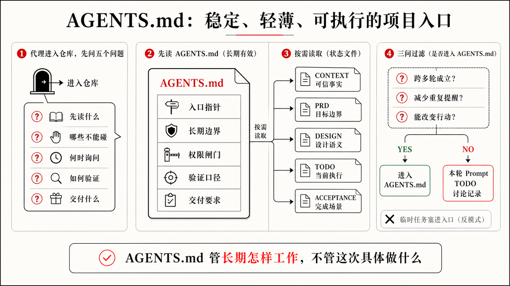
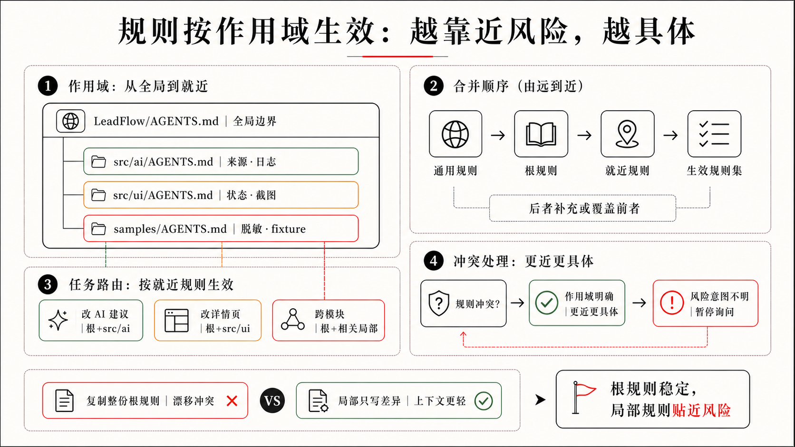

## 2.1 AGENTS.md：项目长期工作协议

LeadFlow 的 Vibe Demo 一句话就可以让 AI 生成出来：一个能点击的线索列表，一个客户详情页，一段看起来像销售建议的 AI 输出。方向看起来对，但第一章说过，Demo 之后有两类问题开始积累：工程债和中间过程不透明。继续靠感觉推进，每一轮修改只是在局部补洞；进入真实工程，就要在改代码之前，先把判断放到项目里——用 AI 能读取的格式，而不是只存在于某次对话和人的记忆里。

第一章最后讲到，人和 AI 的职责最终要落到 `AGENTS.md`、`CONTEXT.md`、`PRD.md`、`DESIGN.md`、`TODO.md` 和 `ACCEPTANCE.md` 这几个可共享对象上。在逐个拆解它们之前，先回答一个更基础的问题：为什么要用多个文件和 Coding Agent 协作，而不是把所有事情都写进一次 Prompt？

原因不在于“文档更正式”，而在于 Coding Agent 面对的不是一次问答，而是一个会持续变化的工程世界。它要读取仓库，理解产品目标，遵守项目边界，修改代码，运行验证，处理中途失败，还要把完成证据和剩余风险交还给人。Prompt 很适合表达本轮意图，却不适合长期保存项目规则、当前事实、设计约束、执行状态和验收标准。把所有信息都塞进一段对话里，短期看起来方便，任务一长就会变成一团难以判断的混合物：哪些规则长期有效，哪些只是本轮偏好，哪些事实已经过期，哪些标准才算真正完成。

如果借用上下文工程里的说法，项目规则更接近“静态上下文”：它们应该在 Agent 进入项目时稳定可见，但也因为会被反复读取，所以必须足够短、足够准、足够能改变行动。当前任务、历史讨论和详细背景则更适合按需进入动态上下文。`AGENTS.md` 的第一层价值，就是把最小且长期有效的静态上下文放在仓库里，而不是让每一轮 Prompt 重新背一遍项目规矩。

多个文件的价值，是把不同类型的工程状态放到不同位置。长期工作协议不要和本轮任务混在一起，当前事实不要和旧资料混在一起，产品边界不要被拆成实现步骤，设计语义不要只留在截图里，完成标准也不要只出现在最终回复中。这样做不是为了让人多写文档，而是为了让 Coding Agent 可以稳定读取、按需引用、执行后回写，并且让下一轮任务和团队成员都知道该相信哪一份状态。

本章介绍的文件组合，也不是所有项目必须照抄的标准目录。每个人都可以根据自己的项目、团队和风险来改名、合并、拆分这些文件，甚至用别的结构替代它们。相对来说，`AGENTS.md` 和 `TODO.md` 更接近 Agentic Coding 的基础入口：前者告诉 Agent 在这个项目里长期怎样工作，后者记录当前任务推进到哪里、下一步从哪里恢复。至于 `CONTEXT.md`、`PRD.md`、`DESIGN.md` 和 `ACCEPTANCE.md`，是我在大量实践中总结出来的一组高频协作文件，用来承载最容易混乱的四类状态：可信事实、产品目标、设计约束和完成标准。

所以，读这一章时不要先记文件名。真正要记住的是：Coding Agent 需要的不只是当前指令，还需要一组可读取、可更新、可审查的外部状态。文件名可以变，目录可以变，生成方式也可以变；但长期规则、当前事实、产品边界、设计约束、执行状态和验收标准，如果全部挤在 Prompt、聊天记录和人的记忆里，Agentic Coding 就很难从一次聪明的生成，变成可持续的工程协作。

这也是第一章说的 Harness 在项目里的落点之一。模型负责推理和生成，Harness 负责把规则、上下文、工具、验证和回写组织成可重复的工作系统；而这些文件，就是团队最容易维护、最容易版本化、也最容易被 Codex 读取的一部分 Harness。

`AGENTS.md` 可以先理解为仓库根目录里的项目长期工作协议。它写给 Coding Agent，不写某一版产品需求，也不记录当前任务清单，而是保存这个项目长期有效的工作方式：先读哪些入口、哪些边界不能碰、哪些动作要确认、交付时要给出什么证据。第一章说，Agentic Coding 不是让人微操 AI 的每一步，而是把人的目标、边界、权限、验收和共享状态放进工作系统里；`AGENTS.md` 就是把其中一部分长期控制点落到仓库里的文件。

为什么需要这样一份文件？因为如果长期规则只留在每一轮 Prompt 里，协作很快会变成一种奇怪的记忆劳动。产品经理记得风险，设计师记得状态，工程师记得实现边界，销售记得业务禁区；但新的 AI 会话进入仓库时，只能看到这一轮你刚刚输入的几句话。

在 LeadFlow 里，这种记忆劳动很容易变成一串重复提醒。如果你每次让 AI 改功能，都要重新强调：

```text
客户手机号和邮箱不能进入日志。
AI 建议不能自动发送给客户。
AI 不能编造客户预算。
涉及真实 CRM 数据要先确认权限。
改了产品行为要同步 TODO 和验收。
完成后要说明验证证据和未覆盖风险。
```

这说明问题已经不在 Prompt。上面这些要求不是本轮临时偏好，而是项目长期工作协议。它们需要一个稳定、可被 AI 反复读取的位置，而不是每次靠人临时补一句。

落到 LeadFlow 这样的项目，这份启动协议先放在仓库根目录，再在里面指向其他重要文件的位置。其他文件可以在根目录，也可以放进 `docs/`、`product/` 或团队约定的其他位置；关键是根目录这份协议能告诉 AI 去哪里读它们，或者在它们尚未存在时，知道应该通过哪类 Skill 或准备流程把它们生成出来。

CRM 类产品的几类判断尤其容易散开：线索的定义有历史叫法，AI 建议的边界有业务争议，隐私字段有合规要求，外发权限有审批流程。LeadFlow 刚做完 Vibe Demo，这些判断还都分散在对话记录和团队记忆里。第一步是把它们找到稳定落点——`AGENTS.md` 放在根目录，指向 `PRD.md`（首版边界）、`CONTEXT.md`（统一叫法）、`ACCEPTANCE.md`（验收场景）：

```text
LeadFlow/
  AGENTS.md
  PRD.md
  CONTEXT.md
  DESIGN.md
  ACCEPTANCE.md
  TODO.md
  src/
  samples/
```

根目录的 `AGENTS.md` 承担的是项目级工作协议。以后 Codex 从这个仓库开始任务时，就能先看到这些长期规则：哪些文件是入口，哪些数据不能碰，哪些动作要审批，完成后要交代哪些验证证据。后面如果某个高风险目录需要更细规则，再在那个目录下补一个局部 `AGENTS.md`；但第一步，先把根目录这份写清楚。

### 它回答的不是“这次做什么”

`AGENTS.md` 最容易被写错的地方，是被当成当前需求清单。例如：

```md
- 本周把 AI 建议卡片放到客户详情页右侧。
- 这次按钮文案先叫“生成跟进建议”。
- 当前先不做销售阶段筛选。
```

这些信息可能有用，但它们不适合长期放在 `AGENTS.md`。它们更适合进入当前需求、`TODO.md` 或一次性的任务说明。`AGENTS.md` 保存的是另一类信息：无论这一轮改列表、下一轮改详情页，还是再下一轮改 AI 建议，AI 都应该遵守的项目工作方式。

这和 `PRD.md`、`DESIGN.md`、`TODO.md` 的职责不同。`PRD.md` 解释这一版为什么做、做给谁、核心目标和非目标是什么。`DESIGN.md` 解释视觉系统、组件策略、用户流程、界面状态和风险表达怎么处理。`TODO.md` 记录当前推进到哪里。`AGENTS.md` 则回答：无论本轮任务是什么，在这个项目里都应该怎样行动。



### 长期有效，才值得写进去

判断一条内容是否适合进入 `AGENTS.md`，可以先问三个问题。它们不是格式检查，而是在判断这条信息是否真的值得变成长期协议：

```text
它是否跨多轮任务都成立？
它是否能减少反复提醒？
它是否足够明确，AI 能据此改变行动？
```

顺着这三个问题看，LeadFlow 里适合写入的，通常是本轮任务换了也仍然需要 AI 先知道的边界：

- 项目入口和重要目录；
- 当前项目的默认数据边界；
- 长期安全、隐私和质量规则；
- 常用命令和验证口径；
- 需要审批的动作；
- 交付时必须说明的信息；
- 修改后需要回写哪些状态。

这时不必先写一整份模板，只要把能改变行动的几条规则写清楚：

```md
- 产品目标见 `PRD.md`，当前事实见 `CONTEXT.md`，设计系统见 `DESIGN.md`，活跃任务见 `TODO.md`，验收场景见 `ACCEPTANCE.md`。
- 除非当前任务明确允许，不得读取、导入或同步真实 CRM 数据。
- 除非当前任务明确要求，不得新增自动客户消息。
- 涉及 AI 建议的改动必须保留来源记录，记录不足时不得编造客户事实。
- 安装依赖、使用网络访问、接触真实 CRM 服务或新增外部集成前，先询问。
- 交付时汇总行为变更、验证证据、未验证项与剩余风险。
```

这些规则不会因为本轮改列表、下轮改详情页、再下轮改 AI 建议而失效。它们描述的是项目长期工作方式。

反过来，不适合写入的内容也很清楚，它们通常只属于某一轮任务或某一次讨论：

- 本轮临时任务；
- 一次性文案偏好；
- 已经过期的实验方案；
- 尚未决定的产品想法；
- 大段业务背景；
- 当前 TODO 里的细节进度。

如果把这些都塞进去，`AGENTS.md` 很快会变成垃圾桶。AI 每轮都读到一堆旧限制、旧愿望和旧实验，反而更难判断什么真正重要。

### 一份够用的 AGENTS.md 长什么样

LeadFlow 有一个写 `AGENTS.md` 时特有的风险：CRM 工具的产品边界天然模糊，“客户关系管理”能容纳的功能几乎没有上限。你说“加 AI 建议”，AI 可能顺手接入外部模型、补自动外发、加权限系统。第一章里你已经攒着三类限制——隐私字段不能进日志、建议必须有来源、不能自动对客户承诺——这三条是跨任务都要遵守的协议，不是某一轮改建议卡片时才临时想起来的细节。把它们写进 `AGENTS.md`，才能让每次进入仓库的 AI 先知道边界在哪里，再动手实现。

`AGENTS.md` 不需要很长，更不需要把产品规则、设计状态和验收细则都搬进来。它更像一个薄入口：写清协作口径、读取指针、长期工作规则、长期边界，以及验证与交付口径，把具体的产品和设计判断指向对应文件。一份够用的版本可以是这样：

```md
# AGENTS.md

## 项目协作说明

- 用中文回复。
- 本项目是 LeadFlow，一个面向脱敏销售线索的内部工作台。
- 后续任务以 `TODO.md` 为准；尚未生成 `TODO.md` 时不算错误。

## 开始工作前按需读取

- 产品目标与非目标：`PRD.md`
- 当前可信事实与术语：`CONTEXT.md`
- 设计系统与界面状态：`DESIGN.md`（仅 UI 相关任务）
- 当前活跃任务与进度：`TODO.md`
- 完成标准与验收场景：`ACCEPTANCE.md`

## 长期工作规则

- 改变产品行为前，先读相关上下文文件，再动手。
- 优先沿用现有项目模式，变更范围限定在当前活跃任务内。
- 安装依赖、联网、接触真实 CRM 或新增外部集成前，先询问。

## 长期边界（跨任务不变）

- 默认只使用脱敏样例数据；不得记录客户手机号、邮箱、合同金额或原始消息正文。
- 涉及 AI 建议的改动必须保留来源记录，记录不足时不得编造客户事实。
- 真实 CRM 接入、外部模型调用和自动外发能力需要明确授权。

## 验证与交付

- 按改动风险选择最小但足够的验证；涉及 AI 建议、来源、隐私或确认流程时，回到 `ACCEPTANCE.md` 对应场景确认。
- 涉及真实 CRM、权限或外发消息时，采用发布级验证并报告残余风险。
- 交付时说明行为变更、验证证据、未验证项与剩余风险。
- 产品行为、设计状态或验收状态变化时，更新对应文件，或说明为何无需更新。
```

这份文件让 AI 进入项目时知道几件关键事：

- 当前项目的长期边界；
- 哪些文件分别承载目标、设计、任务、验收和上下文；
- 哪些动作不能默认自主执行；
- 完成后要用什么信息交还给人。

这些信息已经足够让很多任务少走弯路。它不替代 `PRD.md`、`DESIGN.md`、`TODO.md` 和 `ACCEPTANCE.md`，只负责把第一章说的长期边界和共享意图，放到 AI 每次进入项目时都会先看到的位置。

### 它应该短、准、可执行

`AGENTS.md` 不是百科全书。它不是为了把所有项目知识装进去，而是为了把 AI 每次进入项目时必须先遵守的工作协议放在一起。好的 `AGENTS.md` 有三个特点。

第一，短。它只保存跨任务都成立的规则。详细背景、当前任务、历史决策、设计状态和验收场景，应该放在更合适的文件里。根文件太长，AI 每轮都会背着大量无关信息行动，重要规则反而被淹没。

第二，准。不要写“保持代码质量”“注意用户体验”“回答要准确”这种好听但不可执行的话。更好的写法是：

```md
- 除非当前任务明确要求，不得新增真实 CRM 集成。
- AI 建议须保留来源记录与销售确认状态。
- 不得记录电话、邮箱、合同金额或原始客户消息。
- AI 建议相关的 UI 状态与设计系统变更须遵循 `DESIGN.md`。
```

这些规则能改变 AI 的行动：它会少编造、少越界，也更容易知道该回到哪份设计或验收文件里确认边界。

第三，可执行。一条规则最好能让 AI 判断：我现在是否触碰了它？如果触碰了，应该继续、停止、请求确认，还是补充证据？例如：

```md
- 安装依赖或使用网络访问前，先询问。
```

这条规则很清楚。AI 一旦准备安装新包，就知道要停下来。它不需要猜“为了完成任务可不可以先装一个库”，也不需要等到人 Review 时才发现权限已经越过。

### 不同目录可以有不同规则

一个项目里，并非所有规则都适用于所有文件。根目录的 `AGENTS.md` 可以写全局工作协议。某些高风险目录，还可以有更局部的规则。

这不只是组织习惯，也和 Codex 读取规则的方式有关。在当前 Codex 官方说明里，Codex 会在开始工作前读取 `AGENTS.md`，并按全局、项目根目录到当前工作目录的顺序合并指令；更靠近当前目录的文件出现在后面，因此可以覆盖更早的通用规则。

这给了一个很朴素的写法：根目录只写全项目都成立的协议，目录级 `AGENTS.md` 只写本目录的差异规则，不要复制整份根文件。比如 AI 调用目录可以这样写：

```md
# src/ai/AGENTS.md

- 不得记录完整 prompt、API 密钥、token 或授权头。
- 任何建议生成相关变更须保留 sourceIds。
- 信息不足行为的变更须有验收覆盖。
```

其中 `sourceIds` 这条规则直接回应了第一章已经出现的问题：LeadFlow 的 AI 总结到底来自哪条沟通记录，还是模型凭感觉补全的？把这条要求放进 `src/ai/AGENTS.md`，AI 每次改建议生成逻辑时都先知道：来源不能省，信息不足时要呈现边界状态，而不是继续显示一段看起来确定的建议。

这样做有两个好处。第一，规则更贴近风险。样例数据目录可以关心脱敏，AI 调用目录关心日志和来源，详情页目录关心状态表达。根目录不必塞进所有细节。第二，AI 更容易判断当前任务需要读取哪些规则。改样例数据时，看样例目录规则；改 AI 建议时，看 AI 目录规则；做跨模块任务时，再把规则合起来。

这也是 Agentic Coding 中“上下文不是越多越好”的延续。规则也要按作用域管理；越靠近具体风险，规则越应该具体，越靠近项目根目录，规则越应该稳定。



### AGENTS.md 需要从真实错误中生长

很多人第一次写 `AGENTS.md`，会想一次性把所有规则写完。这通常写不好。更可靠的方式，是从真实任务里的反复纠偏中生长。

第一次 AI 实现跟进建议时，忘了“客户没有提预算就不能生成预算建议”。你在 Review 中指出：

```text
客户没有提到预算时，不能让 AI 编造预算判断，请补边界状态。
```

如果这是一次性问题，可以先放进当前 TODO 或 ACCEPTANCE；如果以后每次改 AI 建议都必须遵守，就值得写进 `AGENTS.md`：

```md
- 除非来源记录明确支持，AI 建议不得推断客户预算。
```

再比如，AI 连续几次为了“提高转化”提出自动发送跟进邮件，而首版其实只允许生成销售草稿。这时也可以沉淀成规则：

```md
- 除非当前任务明确要求，不得新增自动外发消息。
```

`AGENTS.md` 最好的来源，不是凭空想象的规范，而是项目中真实发生过、以后还会发生的偏差。这也和第一章的人机分工一致：人不需要微操 AI 的每一步，但要把反复出现的风险、边界和验收判断沉淀成系统能读取的规则。

### 它不是万能安全网

有了 `AGENTS.md`，不代表可以完全放手。它仍然会过期：首版不接真实 CRM，到了内测阶段可能会变成“接入真实 CRM 必须经过脱敏、权限和日志检查”。它也可能冲突：根目录说“UI 变更要浏览器检查”，某个包没有页面入口，AI 需要结合当前任务判断，无法判断时应该问人。它还可能太多：规则越堆越厚，后来的 AI 会读到一堆历史包袱，定期清理过期规则本身就是 Agentic Engineering 的一部分。

更重要的是，`AGENTS.md` 只告诉 AI 应该怎样工作，不证明这次真的做到了。写了“AI 建议必须保留来源”，不代表代码真的保留了来源；`AGENTS.md` 让 AI 知道长期要求，`ACCEPTANCE.md` 和验证证据才说明这次是否满足要求。所以，`AGENTS.md` 是长期协议，不是验收凭证。

下一节的 `CONTEXT.md`，则回答另一个问题：长期工作协议之外，这个项目里的那些词到底指什么，团队和 AI 怎样才能说同一套语言？
