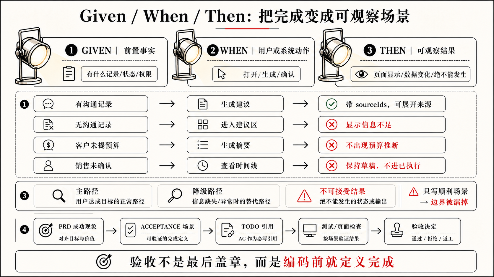
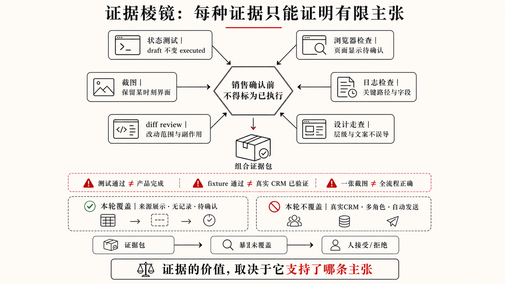

## 2.6 ACCEPTANCE.md：把完成变成可检查场景

2.5 把 LeadFlow 目标拆进了 `TODO.md`，但勾选或「进行中」回答不了：**凭什么说这项完成了？** 销售运营看「页面齐了」、销售看「建议像分析」，这些可能都会把 Demo 级界面当成可对客户讲的事实。所以 `ACCEPTANCE.md` 的职责，是把完成标准**提前**写成可观察、可复查、可回写的场景；它不是测试文件，也不是事后的总结。

Codex 在执行中也要做同类判断：失败是否继续修、能否交付、证据是否够。若完成标准只存在于人脑子里，它往往只能依赖改完文件、命令通过、页面无报错等粗信号来猜「算不算完成」。在 LeadFlow 这类 AI 建议场景里，这类误判尤其致命：建议可以读起来像确定分析，草稿也可以排成已执行样式，构建同样能通过，这些都比页面崩溃更难被粗信号拦住。Demo 里卡片能显示，仍可能出现来源缺失、无记录回退通用话术、确认前标成已执行、手机号邮箱进日志。这些期待不能留在人脑子里，必须写成同一组可检查场景，Codex 和人才会用同一把尺。

### 验收不是最后盖章

所以 `ACCEPTANCE.md` 是任务开始前就放在桌上的尺子：什么必须成立、什么不可接受、什么证据算交付、什么风险本轮不覆盖。它不要求全自动化，但要够具体，让 Codex 和人在执行过程中用同一把尺，而不是各自用「看起来有了」来猜。

### 抽象要求要拆成场景

PRD 写「建议必须基于沟通记录」，`TODO.md` 也能拆成任务，但「基于」仍会被各自理解：提客户名算不算？要不要指向具体记录？无预算能否补常识？记录冲突取哪条？不拆开，AI 会在实现里替人做产品判断，界面却仍是「像真分析」。写进 `ACCEPTANCE.md` 的，应是一组 **Given / When / Then** 场景，写清前置状态、动作和外部可观察结果；完成不再靠「看起来有了」，而靠页面、日志或审查能核对的事实。

```md
# ACCEPTANCE.md

## AI 建议必须显示来源

Given 某条线索有两条沟通记录
When 系统生成下一步跟进建议
Then 建议必须关联至少一条来源记录，并允许用户展开查看来源内容

证据建议：
- 状态流转或生成逻辑测试覆盖 `sourceIds`
- 客户详情页检查来源入口是否靠近建议正文
- 相关 diff 显示建议模型没有丢失来源字段

不覆盖：
- 真实 CRM 同步后的来源追踪
- 句子级引用
- 多角色权限过滤

## 沟通记录不足时不生成建议

Given 某条线索没有沟通记录
When 用户打开 AI 建议区域或请求生成下一步建议
Then 页面显示“暂无足够沟通记录，无法生成建议”，而不是生成通用销售话术

证据建议：
- 无记录 fixture 的单元测试或集成测试
- 客户详情页空状态截图或浏览器检查
- diff review 确认没有回退到静态示例建议

## 客户没有提预算时不得编造预算

Given 沟通记录中没有预算、合同金额或采购时间信息
When AI 生成客户需求总结或下一步跟进建议
Then 系统不得把预算、合同金额或采购意向写成客户事实

证据建议：
- 含缺失预算的样例记录检查
- AI 输出文案人工审查
- 日志或模型请求摘要确认没有注入虚构预算字段

## 销售确认前不得标为已执行

Given AI 已生成下一步跟进建议
When 销售用户尚未确认或编辑该建议
Then 建议状态为“待确认”，不得出现在已执行跟进记录中

证据建议：
- confirmationStatus 状态流转测试
- 页面检查待确认状态和已执行时间线的分离
- 设计验收确认主按钮不是“发送给客户”
```

这份示例不追求完整覆盖 LeadFlow 的所有风险，而是展示验收文件应该怎样改变 AI 的行动。Codex 读到它以后，就不能只实现一个漂亮的建议卡片；它要保留来源、处理无记录状态、避免编造预算、区分待确认和已执行，并在交付时说明哪些证据支持这些判断。



### 场景要覆盖不可接受结果

很多验收只写成功路径，例如「用户打开线索详情页，系统返回 AI 跟进建议」。这只回答功能在不在，回答不了建议可不可信。对 LeadFlow 来说，上文那些来源缺失、无记录硬补、草稿标成已执行等问题，成功路径常常一并放过；卡片一出现，销售在电话前更难察觉语义错误，销售运营在晨会上也更容易把「有建议卡片」当成「分析已经成立」。验收因此还要写清不可接受结果，至少包括：

- 没有沟通记录却生成通用建议
- 客户没有说预算却推断预算水平
- 来源入口存在但和建议内容无关
- 销售确认前建议被标为已执行
- AI 推测和客户事实混在同一段文字里
- 手机号或邮箱出现在日志里
- 模型请求失败时页面仍显示“建议生成成功”
- 修改建议功能时顺手接入真实 CRM

它们都值得进入验收边界。

```md
## 不允许无来源建议伪装成可信建议

Given 当前建议没有 `sourceIds`
When 系统准备展示 AI 下一步建议
Then 页面不得把该建议显示为可信建议，并应提示来源缺失或信息不足

## 不允许用假建议掩盖记录缺失

Given 某条线索没有沟通记录
When 用户打开客户详情页
Then AI 建议区域显示记录不足状态，不回退到静态示例建议或通用销售话术
```

这些负面场景看起来像“不要做什么”，实际是在保护 AI 的执行边界。它们告诉 Codex：为了让页面完整而补假数据，不是小瑕疵；为了让流程顺畅而把建议标成已执行，不是可接受折中；为了让调试方便而打印隐私字段，也不是可以忽略的实现细节。

### 测试是验收证据之一

`ACCEPTANCE.md` 不等于测试文件。测试很重要，它可以把一部分场景变成可重复执行的检查，但验收标准本身是人的意图和风险边界，证据只是证明它的方式。一个场景可能通过单元测试验证，也可能需要浏览器检查、截图、日志、diff review、设计走查或人工审查共同支撑。

在 AI 生成代码的工作流里，可以把测试和评估看成同一份验收契约的不同证据。测试更适合验证确定性部分：给定输入，状态、函数、页面或日志应该产生什么结果；评估和人工 Review 更适合覆盖不确定性部分：AI 是否选择了合适工具，是否遵守了来源边界，是否把推测和客户事实分开，是否在信息不足时停了下来。没有验收场景，这些证据会各说各话；有了验收场景，测试、截图、日志和 Review 才知道自己在证明同一个标准。

例如「销售确认前不得标为已执行」可以有多种证据。状态流转测试能证明数据模型不会直接把 draft 写成 executed；浏览器检查能证明页面确实显示待确认状态；截图能保留当时的界面证据；diff review 能确认没有把确认动作接到自动外发流程；设计走查能判断按钮文案是否会误导销售。在 LeadFlow 里，主按钮写成「发送跟进」而不是「确认草稿」，就可能让销售以为系统已经替自己做了对外承诺。每种证据都只支持有限主张，不能互相替代。



### 验收也要说明不覆盖什么

很多验收失败，不是因为场景写错，而是因为场景暗中承诺太多。LeadFlow 里典型的情况是：「AI 建议必须显示来源」在脱敏 fixture 上通过了，就被汇报成「来源能力已完整验证」，但真实 CRM 同步、多角色权限、句子级引用和对外发送前审批都还没进本轮范围。销售运营若据此判断可以进下一阶段，就会把局部通过误当成全局可信。

所以，`ACCEPTANCE.md` 可以明确写「不覆盖」。这不是降低标准，而是让标准真实：清楚说明本轮覆盖了什么、没有覆盖什么，以及哪些风险应该进入后续 TODO、发布检查或人工决策。

```md
## AI 建议必须显示来源

不覆盖：
- 真实 CRM 同步后的来源追踪
- 句子级引用
- 多角色权限过滤
- 自动发送前审批
- 大规模沟通记录性能
```

这几行会改变后续协作。任务交付时，Codex 不能把本地 fixture 的通过结果说成“来源能力已完整验证”；负责人也能更准确地判断这次是否可以进入下一阶段，还是需要把真实 CRM、权限和发布级验证另立任务。

### ACCEPTANCE.md 要成为完成标准的事实源

`ACCEPTANCE.md` 不是孤立文件，但它也不应该把其他文件的内容重新抄一遍。更好的关系是：`PRD.md` 给它产品边界，`DESIGN.md` 在 UI 任务里给它界面状态，`CONTEXT.md` 给它术语和必要事实，`TODO.md` 指向它作为当前任务的完成标准。也就是说，验收文件应该成为“完成标准”的事实源，而不是又一份混合文档。

真实项目里，这个文件未必一定叫根目录 `ACCEPTANCE.md`。规模更大的项目常常把验收契约按模块拆开，放在 `prd/<模块>/acceptance.md` 里，`TODO.md` 只保留一行指针。本书默认用根目录 `ACCEPTANCE.md` 讲清概念，读者落地时可以按项目规模拆成模块验收文件。关键不是文件名，而是验收标准只在一个地方定义。

### PRD 和 acceptance 可以住在同一个模块文件夹

当 PRD 按模块拆分以后，验收文件自然可以和产品说明住在一起。`prd/<模块>/README.md` 说明这个模块要做什么，`prd/<模块>/acceptance.md` 说明什么场景成立才算完成，`prd/<模块>/technical.md` 保留实现路径和代码位置。三者都属于同一个模块，放在同一个文件夹是合理的。

对 LeadFlow 的 AI 建议模块来说，可以这样按模块组织验收。模块拆开，是因为 CRM 里「建议可信」「列表能扫」「详情能决策」是不同风险面，验收不应混在一份大清单里：

```text
prd/
  ai-suggestion/
    README.md            # 产品边界：建议必须基于沟通记录，信息不足不得生成
    technical.md         # 实现路径、sourceIds 数据结构、API 位置
    acceptance.md        # GWT 场景：来源展示、无记录空状态、隐私字段
  lead-list/
    README.md
    technical.md
    acceptance.md
```

这个共址关系的好处是：产品意图和完成证据不会因为项目变大而分离。AI 处理 `ai-suggestion` 模块时，读 `README.md` 知道边界，读 `acceptance.md` 知道场景，不需要跨文件夹拼接两份信息；团队下一轮迭代时，也能在同一个地方判断这个模块「要做到哪里」和「怎么验证它做对了」。

这也让 `TODO.md` 的引用更简洁。单文件阶段，TODO 可以分别引用 PRD 和 acceptance：

```md
- [ ] AI 下一步建议保留来源记录
  - 设计：见 `DESIGN.md`
  - 验收：见 `ACCEPTANCE.md#AI建议必须显示来源`
  - 状态：进行中
```

模块拆分以后，整个模块的产品边界和完成标准都在同一个文件夹里，TODO 只需要一行指针：

```md
- [ ] AI 下一步建议保留来源记录
  - 验收契约：`prd/ai-suggestion/acceptance.md`
  - 状态：进行中
```

验收文件则保留完整场景、证据建议和不覆盖范围。任务执行后，TODO 记录当前状态和最近验证结果；如果验收场景本身发生变化，再更新验收文件。这样做的好处是，任务勾选不会把完成标准一并带走，PRD 也不会复制一份可能过期的验收清单。下一轮有人修改 AI 建议逻辑时，仍然能回到同一条验收场景，而不是从旧聊天或最终回复里猜当时为什么算完成。

### 一份轻量 ACCEPTANCE.md 可以长什么样

Demo 能点按钮，不等于已经有可检查的完成标准。LeadFlow 首版验收不必第一天就写成完整测试矩阵，但应先围住 Demo 之后最容易再犯的错：无记录时硬补话术、来源看不见、草稿被标成已执行、隐私字段进日志。更实用的做法，是先围绕这四类行为写三到七条场景，每条包含前置条件、动作、结果、可用证据和不覆盖范围。下面这个轻量骨架已经足够支撑 AI 建议闭环的首版验收：

```md
# ACCEPTANCE.md

## 范围

本文件覆盖 LeadFlow MVP 中 AI 下一步建议、来源展示、销售确认和隐私日志的首版验收。
当前验收基于仓库内脱敏样例线索和沟通记录，不覆盖真实 CRM、自动外发、多角色权限和发布级性能。

## 场景 1：有沟通记录时建议必须带来源

Given 线索存在至少一条沟通记录
When 系统生成 AI 下一步建议
Then 建议必须关联来源记录，并允许用户展开查看来源内容

可用证据：
- 生成逻辑测试覆盖 `sourceIds`
- 客户详情页来源展开检查
- diff review 确认来源字段没有被 UI 丢弃

## 场景 2：无沟通记录时不得生成通用建议

Given 线索没有沟通记录
When 用户查看 AI 建议区域
Then 页面显示信息不足状态，不生成客户需求、预算判断或通用销售话术

可用证据：
- 无记录 fixture 检查
- 空状态浏览器检查或截图
- diff review 确认没有回退到旧静态建议

## 场景 3：销售确认前建议保持草稿状态

Given AI 已生成下一步建议
When 销售尚未确认或编辑该建议
Then 建议显示为待确认，不进入已执行跟进记录，也不触发对外发送动作

可用证据：
- 状态流转测试
- 页面检查待确认状态和已执行记录分离
- 设计验收确认主按钮语义正确

## 场景 4：隐私字段不得进入日志

Given 样例线索包含手机号、邮箱或合同金额字段
When 系统生成摘要、建议或调试日志
Then 日志中不得输出这些字段的原文

可用证据：
- 日志脱敏测试或命令输出检查
- 相关 diff review
- 人工审查模型请求摘要
```

这份模板的重点不是写满所有可能性，而是让完成标准先进入项目。等真实 CRM、权限、发布和外部模型调用进入范围时，再把对应风险补成新的验收场景，而不是让首版验收假装已经覆盖未来所有条件。

### 验收文件也需要回写

`ACCEPTANCE.md` 会随着项目变更而变化。来源粒度从沟通记录级升级到句子级，销售确认从本地状态写回 CRM，无记录状态从空态提示变成补录流程，日志规则从本地检查升级到服务端审计，真实模型调用进入 MVP，这些都会改变完成标准。代码变了，验收不变，下一轮 AI 就会继续按旧标准认为已经完成。

回写不等于把每次验证流水都塞进 `ACCEPTANCE.md`。更合理的分工是：场景、证据类型和不覆盖范围留在 `ACCEPTANCE.md`；本轮哪些场景通过、跑了什么命令、失败过什么、哪些未覆盖项留下，记录在 `TODO.md` 或验证报告里。如果一个失败路径被证明是长期风险，再把它补成新的验收场景。

例如任务结束后，TODO 可以写：

```md
- [x] AI 下一步建议保留来源记录
  - 验证：sourceIds fixture 通过；详情页来源展开已检查。
  - 未覆盖：真实 CRM 同步；句子级引用；多角色权限。
  - 回写：`ACCEPTANCE.md#AI建议必须显示来源` 保持有效。
```

如果执行中发现新的风险，比如「来源记录存在但和建议内容无关」：销售展开来源后仍无法判断建议是否站得住脚，就应该把它补进 `ACCEPTANCE.md`。这类回写会让验收从一次任务的检查清单，逐步变成项目长期可信的完成标准。

### 一份 ACCEPTANCE.md 是否合格

检查 `ACCEPTANCE.md` 时，不要只看它有没有 Given / When / Then，而要看它能否真正改变 AI 的下一步行动。

1. 它是否把抽象要求拆成可观察场景？
2. 是否说明前置条件、动作和结果？
3. 是否覆盖关键失败路径和不可接受结果？
4. 是否列出可以支撑判断的证据类型？
5. 是否明确本轮不覆盖哪些风险？
6. 是否能被 TODO 引用？
7. 是否承接了 `DESIGN.md` 中的关键状态和 `CONTEXT.md` 中的当前事实？

拿 LeadFlow 的「场景 2：无沟通记录时不得生成通用建议」来说：它对应销售打开详情页时的可观察结果，前置条件是线索没有沟通记录，Then 要求信息不足态而不是报价话术。这与 `DESIGN.md` 的信息不足态和 `PRD.md` 场景二「没有预算信息就不该出现报价话术」承接同一条边界；证据可以是 fixture 检查、空状态截图和 diff review，不覆盖真实 CRM 和句子级引用。七个问题都能回答，场景才真正能改变 AI 的停止条件。

如果这些问题基本能回答，`ACCEPTANCE.md` 就不只是验收清单，而是 AI 执行过程中的停止条件。它让 Codex 知道什么时候不该因为“页面出现了”就停，也让人知道最终汇报里的证据到底支持了哪些主张。

到这里，本章已经把六类外部状态基本铺开：`AGENTS.md` 管长期工作协议，`CONTEXT.md` 管可信语言和必要事实，`PRD.md` 管目标和非目标，`DESIGN.md` 管设计系统和界面状态，`TODO.md` 管当前执行状态，`ACCEPTANCE.md` 管可检查完成标准。下一节会把它们串成同一条任务链，说明文件协同不是形式，而是让不同类型的事实待在合适的位置。
