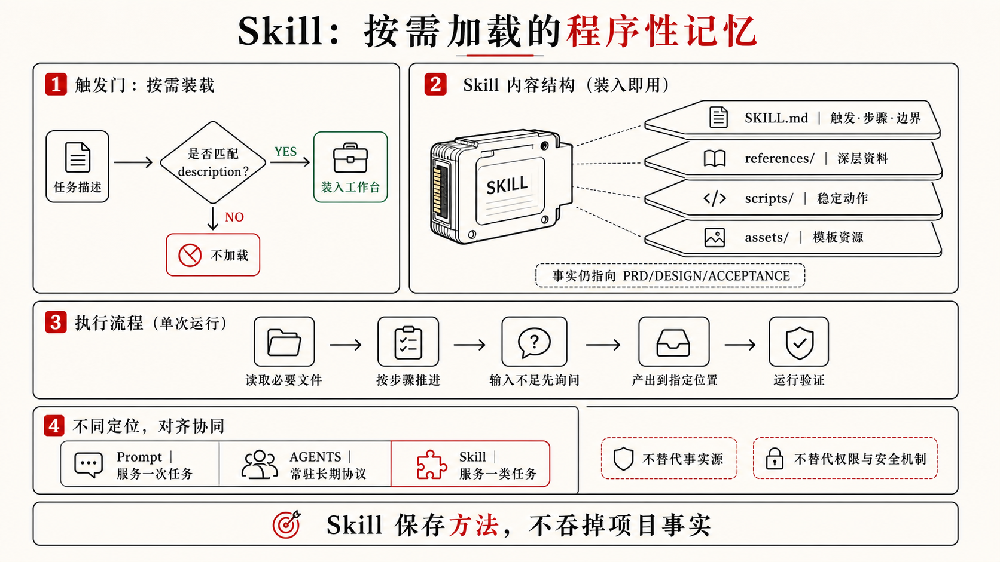
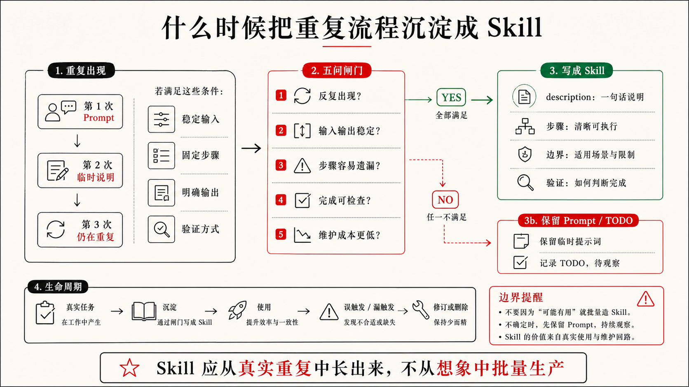

## 3.2 基于现成经验和自己的角色构建 Skills

3.1 已经把脚手架的问题摆出来了：不同经验要待在合适的位置，不能把所有资料都塞进常驻上下文。走到这里，最自然的第一个动作是先理解 Skills，而不是立刻设计一堆 SubAgents 或把所有规则写进 `AGENTS.md`。

Skill 解决的是一个很朴素的问题：有些工作流程你已经反复对 Codex 说过了，它们不该每次都靠临时 Prompt 重新解释。

例如 LeadFlow 每次改 AI 建议，你都要提醒：先读 `CONTEXT.md` 里的术语，确认 `AI Suggestion` 只是草稿；再读 `PRD.md` 的非目标，不能顺手接真实 CRM；再读 `DESIGN.md` 的状态模型，不能把待确认态做成已执行；再读 `ACCEPTANCE.md`，看无来源、无记录、隐私日志这些场景是否覆盖。第一次这样说是任务说明，第三次还在说同一套流程，就已经接近 Skill。

### Skill 是动态上下文，不是更长 Prompt

Prompt 服务这一轮任务，Skill 服务一类任务。

更准确地说，Skill 是一种动态上下文。它平时不需要全部塞进主上下文，只在任务匹配时被加载；加载以后，它告诉 Codex 这类任务应该怎样进入流程、先读哪些文件、按什么步骤推进、产出写到哪里、怎样验证、什么时候停下来问人。

这和第二章的 `AGENTS.md` 正好形成分工。`AGENTS.md` 是最小静态上下文，应该短、准、长期有效；Skill 是按需加载的程序性记忆，适合保存一类任务的完整工作流。把所有流程都写进 `AGENTS.md`，会让静态上下文变重；把所有流程都留在 Prompt 里，又会让每一轮任务重新开始。Skill 的价值就在这两者之间。

可以把它理解成给 Agent 用的操作手册，但这个手册不是给人收藏的，它要改变 Codex 的下一步行动。一个好的 Skill 至少回答这些问题：

```text
什么时候使用？
开始前读哪些文件？
输入不够时怎么办？
按什么步骤推进？
哪些动作需要停下来问人？
输出写到哪里？
如何验证？
不负责什么？
```

这些问题让 Skill 从“提示词模板”变成“可复用流程”。它保存的是一类任务里反复有效的判断顺序，不是要求 Codex 机械照做。

### Skill 解决哪几类问题

在 AI 编程里，Skills 特别适合解决四类麻烦。

第一，提示过载。没有 Skill 时，人容易把所有流程、规则、示例和参考资料塞进一次 Prompt。Prompt 越长，信号越稀，后面还会反复复制粘贴，逐渐变成上下文噪声。Skill 可以让 Codex 先看到轻量描述，只有任务匹配时再加载完整流程。

第二，程序性记忆缺失。模型会推理，但它不会天然记住你这个项目里“AI 建议审查应该先看来源，再看确认状态，再看日志脱敏”。Skill 把这种顺序变成可复用的项目记忆。

第三，过早多 Agent 化。很多专业化需求其实不需要开一个独立 SubAgent。设计走查、PRD 初稿、验收拆解、提交总结，常常由主 Agent 按 Skill 流程完成就够了。先用 Skill，可以减少多 Agent 调度、上下文搬运和结果合并的成本。

第四，跨工具复用。一个写得好的 Skill，不应该只服务某一次对话。它可以放在个人环境、项目仓库，甚至进一步被插件化，让同一套工作方法在多个项目里复用。

这就是为什么第三章先讲 Skills，再讲 SubAgents。很多时候，团队真正缺的是一套可按需加载的工作方法，不是更多“专家 Agent”。

### Skill 通常包含什么

项目级 Skill 可以先放在 `.codex/skills/` 里：

```text
.codex/
  skills/
    leadflow-ai-suggestion-review/
      SKILL.md
      references/
      scripts/
      assets/
```



真正必需的是 `SKILL.md`。它需要有清楚的 `name` 和 `description`，因为描述会影响 Codex 判断什么时候使用这个 Skill。描述太宽，低风险任务也会误触发；描述太窄，真正相关任务又可能错过。

`references/` 适合放深层资料：设计规范、验收写法、接口文档、示例输出、失败案例。不要把所有资料都写进 `SKILL.md`，否则 Skill 会变成另一份大 Prompt。更好的写法是：`SKILL.md` 告诉 Codex 什么时候打开哪些 reference。

`scripts/` 适合放稳定、重复、格式严格的动作：检查敏感字段、生成报告骨架、校验目录结构、整理截图、转换数据格式。越确定、越脆弱、越需要重复执行的步骤，越适合脚本；越需要业务理解和风险判断的部分，越应该留给 Codex 按流程处理。

`assets/` 可以放模板、样例和输出资源。不是每个 Skill 都需要这些目录。一个只有 `SKILL.md` 的轻量 Skill，如果能稳定减少重复解释，就已经成立。

### 先使用现成 Skills，再写自己的

第一次接触 Skills，不要急着写自己的“专家系统”。更好的顺序是：先用现成 Skills，观察它们怎样组织触发条件、步骤、边界和验证。

这和学编程时先用成熟库很像。你不需要第一天就写自己的框架，先看别人怎样拆能力，怎样写边界，怎样处理失败，才知道好 Skill 和长 Prompt 的区别。

现在可以先从 skills.sh（<https://www.skills.sh/>）这样的 Agent Skills 目录看起。它把公开的 Skills 按主题和仓库组织起来，页面上通常会显示安装命令、摘要、`SKILL.md` 片段和仓库链接。安装方式一般形如：

```bash
npx skills add owner/repo
```

或者在某个仓库中只安装指定 Skill：

```bash
npx skills add https://github.com/owner/repo --skill skill-name
```

这里有一个重要提醒：不要把“能安装”当成“可以无脑信任”。安装前至少看三件事：这个 Skill 的触发范围是否清楚，是否包含会执行命令的脚本，仓库和 `SKILL.md` 是否符合你的项目边界。特别是涉及文件删除、外部服务、真实客户数据、密钥、Git 操作和生产环境的 Skill，一定要先看清它会引导 Codex 做什么。Skills 是能力扩展，不是安全豁免。

有几类现成 Skills 值得先看。

第一类是 UI 和设计质量相关的 Skill。比如 ui-ux-pro-max（<https://www.skills.sh/nextlevelbuilder/ui-ux-pro-max-skill/ui-ux-pro-max>），它面向 Web 和移动应用的 UI/UX 设计判断，覆盖界面结构、视觉风格、配色、字体、交互、无障碍、响应式和常见产品类型。对 LeadFlow 这种 CRM 工作台来说，它的价值不是替代 `DESIGN.md`，而是在设计系统和界面状态已经有方向时，帮助 Codex 做更专业的页面实现和体验走查。

例如你让 Codex 优化客户详情页里的 AI 建议卡片，它不应该只把卡片做得“更好看”。如果配合 UI/UX 类 Skill，它更容易检查：来源入口是否靠近建议文本，待确认状态是否足够清楚，主按钮是否会让销售误以为已经发送给客户，移动端是否能承载沟通记录展开，错误和空状态是否给了用户可恢复路径。Skill 在这里沉淀的是设计判断，而不是单一风格。

第二类是 Git 工作流相关的 Skill。比如 git-commit（<https://www.skills.sh/github/awesome-copilot/git-commit>），它围绕 Conventional Commits 生成标准化提交信息，并根据实际 diff 判断类型、scope 和提交内容。对团队来说，这类 Skill 的价值不是“帮我少写一句 commit message”，而是把提交前的 diff 分析、逻辑分组、破坏性变更识别和安全边界变成稳定流程。

不过，Git 类 Skill 也要谨慎使用。它可以帮助整理变更，但不应该替人承担最终确认。特别是工作区里有用户未提交改动、生成文件、密钥文件或临时实验时，提交前仍然要看 `git status` 和 diff。一个好的 Git Skill 应该让提交更可审查，而不是让提交变成自动滑过的动作。

第三类是需求澄清和方案形成相关的 Skill。比如 brainstorming（<https://www.skills.sh/obra/superpowers/brainstorming>），它强调在实现前通过结构化对话把想法变成设计和规格。它对 Agentic Coding 很有启发：很多失败不是代码写错，而是需求还没形成可以委托的形状，Codex 就已经开始实现。

把它放到 LeadFlow 里，你可以在“让销售助手更智能”这种模糊需求进入代码前，先让 Codex 和你澄清：更智能指的是建议更准确、来源更清楚、风险提示更强，还是销售确认流程更顺？哪些属于 MVP，哪些会越界到完整 CRM？哪些状态需要设计师确认？如果这些问题没答清，后面再多测试也只能证明一个不清楚的目标被实现了。

第四类是成熟作者或团队整理出来的一组 Skills。比如 mattpocock/skills（https://www.skills.sh/mattpocock/skills），它不是单个流程，而是一组覆盖 PRD、TDD、诊断、架构改进、代码审查、写 Skill 等任务的能力集合。学习这种集合，不是为了全量照搬，而是观察一个有经验的实践者怎样拆分能力边界：什么适合做成 `to-prd`，什么适合做成 `diagnose`，什么适合做成 `tdd`，什么应该保持为单独 Skill，而不是塞进一个超级助手。

第五类是项目级脚手架里的成组 Skills。比如 CodeNow（<https://github.com/xue160709/CodeNow>），这是作者自己做的一套 Agentic Coding 脚手架样本，读者可以下载来体验一下。除了直接使用，它的价值还在于可以拆开观察如何构建 Agentic Coding 脚手架，而这部分内容会在第五章详细介绍。

这几类例子可以给读者一个实际起点：

表 3-2 常见重复问题与可参考的 Skill 类型

| 反复遇到的问题 | 可参考的 Skill 类型 |
|---|---|
| 页面能跑，但状态、层级和响应式不稳定 | UI / UX 或 design review Skill |
| 需求模糊，Codex 太早开始写代码 | brainstorming / product discovery Skill |
| PRD、验收和 TODO 总要从头整理 | planning / to-prd / acceptance Skill |
| bug 排查容易变成乱改 | diagnose / systematic debugging Skill |
| 提交信息随意，diff 没有逻辑分组 | git-commit Skill |
| 想观察多个 Skills 怎样组成项目生命周期 | CodeNow 这类脚手架样本 |

作者建议初学者也不要一口气装太多 Skills。Skills 太多，触发描述会互相竞争，维护成本也会上升。先装少量高频、低风险、能立刻改善工作质量的 Skills，观察几轮，再决定哪些经验需要项目级沉淀。

### 把 LeadFlow 的经验写成项目 Skill

LeadFlow 最适合先沉淀的，是一个高风险、反复出现、输入输出稳定的流程：AI 建议审查，而不是“做 CRM”这种大而空的能力。

通用 UI/UX Skill 可以提醒对比度、触控区域、响应式和状态反馈，但它未必知道 LeadFlow 的特殊边界：AI 建议不能冒充客户事实，销售确认前不能显示为已执行，沟通记录不足时不能生成通用销售话术，手机号和邮箱不能进入日志。这些判断已经在第二章进入了 PRD、DESIGN、ACCEPTANCE 和 AGENTS。现在它们可以进一步沉淀成一个项目级 Skill。

一个轻量版本可以这样写：

```md
---
name: leadflow-ai-suggestion-review
description: 当任务涉及 LeadFlow 的 AI 建议、来源展示、销售确认、客户详情页建议区域或相关日志时使用；不用于无关的 CRM 列表筛选或纯样式微调。
---

## 工作流

1. 阅读 `CONTEXT.md`，确认 Lead、Communication Record、AI Suggestion 和 Sales Confirmation 的定义。
2. 阅读 `PRD.md`，确认 AI 建议的当前范围、非目标和待决策问题。
3. 阅读 `DESIGN.md` 中关于 AI 建议卡片、来源展示、确认状态和信息不足态的小节。
4. 阅读 `ACCEPTANCE.md` 中关于来源、无记录、确认前状态和隐私日志的场景。
5. 检查相关代码、fixture 和日志路径。
6. 判断本次改动是否保留来源记录、是否让建议在销售确认前保持草稿、是否避免编造预算、合同金额或采购时间。
7. 如果发现新的失败路径，先建议补充 `ACCEPTANCE.md`，再判断任务是否可以标记完成。
8. 汇报行为变化、验证证据、未覆盖范围和需要回写的位置。

## 边界

- 除非当前任务明确授权，不新增真实 CRM 同步。
- 不把 AI 建议当成客户事实。
- 不在日志中输出手机号、邮箱、合同金额或完整客户消息。
- 不替代人工最终验收。
```

这份 Skill 没有替代第二章的文件。它只是规定：当任务触及 AI 建议域时，应该怎样把那些文件读起来、用起来、回写起来。事实仍然在 `PRD.md`、`DESIGN.md`、`CONTEXT.md`、`TODO.md` 和 `ACCEPTANCE.md` 里；Skill 保存的是流程。

这点非常重要。Skill 一旦开始保存项目事实，很快就会和文件系统打架。比如把完整设计系统复制进 Skill，下一次 `DESIGN.md` 更新后，Skill 就过期；把完整验收场景复制进 Skill，下一次 `ACCEPTANCE.md` 变化后，完成标准就分裂。好的 Skill 应该指向事实源，而不是吞掉事实源。

### 什么时候才该写自己的 Skill

判断一个流程是否值得写成 Skill，可以问五个问题。

1. 它是否反复出现？
2. 它是否有稳定输入和输出？
3. 它是否包含容易遗漏的步骤？
4. 它是否有可检查的完成方式？
5. 维护它的成本是否低于每次重新解释的成本？

可以把标准压成一句话：

> 当你连续三次对 Codex 说同一套流程，并且这套流程有稳定输入、步骤、输出和验证方式，就可以考虑把它沉淀成 Skill。



图 3-1 何时将流程沉淀成 Skill

这里的“三次”不是机械数字，它提醒你：Skill 应该从真实任务里长出来。第一次靠 Prompt 完成，第二次把流程写进 TODO 或临时说明，第三次还在重复，就说明它可能已经开始从一次性对话变成项目能力。

### Skill 的边界

Skill 不能替代项目事实。它可以要求“先读 DESIGN”，但不应该保存完整设计系统；可以要求“检查验收场景”，但不应该复制验收文件。

Skill 也不能替代安全机制。它能提醒 Codex 不要读取真实 CRM、不要泄露手机号、不要运行危险命令，但高风险动作仍然需要权限、审批、沙箱、Hook、测试或人工验收接住。

Skill 还会腐烂。LeadFlow 从脱敏样例进入真实 CRM 试点以后，旧 Skill 如果仍然写着“永远不接真实数据”，就会阻碍正确开发；AI 建议从本地草稿变成可写回 CRM 后，确认状态和验收场景也要跟着升级。一个好 Skill 写完以后也不会封存，它会在误触发、漏触发和真实失败中继续改。

所以，搭 Skills 文件夹时，不要追求数量。先接入少量现成 Skills，再观察哪些流程真正改变了 Codex 的读取、实现、验证和汇报。等你看到自己的重复流程，再写项目级 Skill；等项目级 Skill 跨项目稳定复用，再考虑插件化和团队分发。

下一节的 SubAgents，承接的是另一个问题：如果一件任务缺的不是流程，确实需要多个专业视角分头看，应该怎样拆分。Skill 管方法，SubAgent 管分工。两者都能让 Agent 变得更专业，但它们解决的不是同一种问题。
