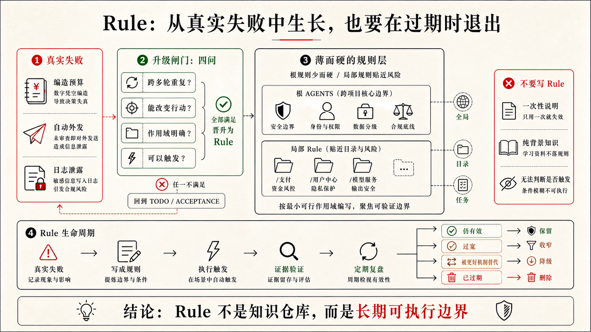

## 3.4 基于需求设计 Rules

第二章把项目状态拆进了 `AGENTS.md`、`CONTEXT.md`、`PRD.md`、`DESIGN.md`、`TODO.md` 和 `ACCEPTANCE.md`。3.2 又把重复流程沉淀成 Skills，3.3 把复杂任务里的专业视角拆成 SubAgents。到了 Rules，我们要处理的是另一类问题：哪些边界不应该随着任务变化而消失。

在 Harness 里，这一层属于“静态上下文”。Rule 不是更长的 Prompt，也不是把所有偏好写进一份“AI 使用说明”。它是一组长期成立、稳定触发、能改变 Agent 行动的边界。Skill 可以按需加载，因为它回答“这类任务怎么做”；SubAgent 可以按需调用，因为它回答“这个复杂任务需要谁独立看”；Rule 更接近项目的常驻约束，因为它回答：

```text
无论这次任务是谁来做、怎么做、做到哪一步，都不能默认跨过哪些线？
```

如果说第二章的文件是 Harness 的事实资产，那么 Rules 就是在这些事实资产之上建立的一层长期边界。它让 Codex 每次进入相似任务时，不必等人重新提醒“别把 AI 建议写成客户事实”“别改 UI 状态前忘记读设计稿”“别在交付时只说完成了而不说验证证据”。这些判断应该被放到系统里。

但 Rules 也最容易写坏。很多团队一开始会把它当成保险箱：每出一次问题，就补一条；每想到一个偏好，就加一句；每担心 AI 误解，就再提醒一次。半年后，规则越来越多，真正重要的边界反而被淹没在一堆“曾经有道理”的句子里。

所以设计 Rules 的第一原则不是“写得更全”。第一步要先判断：

```text
这条经验真的应该常驻在 Harness 里吗？
```

### Rule 是静态上下文，不是知识仓库

Rules 的价值来自常驻，成本也来自常驻。凡是进入静态上下文的东西，都会在后续任务里影响 Codex 的判断。它可能让 Agent 更稳，也可能让上下文变吵、变慢、变矛盾。

因此，Rule 应该只收纳三类内容。

第一类是长期边界。比如密钥不能硬编码、真实客户数据不能进入日志、生产数据导入必须确认。这些不依赖某一次任务，未来每轮都成立。

第二类是高风险触发条件。比如修改 AI 建议、销售确认、对外发送、权限、账单、数据迁移、隐私日志时，必须先读哪些文件、检查哪些验收、在哪里停下来请求确认。

第三类是交付协议。比如涉及产品行为变化时要回写 `TODO.md` 或 `ACCEPTANCE.md`，涉及 UI 状态变化时要提供页面检查证据，涉及外部系统时要说明权限和数据来源。

这些内容适合放进 Rules，因为它们关心的是“这个项目长期不允许怎样做”，已经超出了某一轮任务偏好。反过来，产品范围、设计细节、当前任务状态、完整验收场景、操作流程，都不应该被 Rules 吞掉。

表 3-5 Rules 与其他 Harness 资产的边界

| 对象 | 应该保存什么 | 不应该被 Rules 抢走什么 |
|---|---|---|
| `PRD.md` | 目标、范围、非目标、成功标准 | 不要把完整产品规格复制进 Rule |
| `DESIGN.md` | 状态模型、交互、视觉系统、风险表达 | 不要把设计系统写成零散禁令 |
| `TODO.md` | 当前进度、阻塞、恢复点、最近验证 | 不要让 Rule 变成任务状态表 |
| `ACCEPTANCE.md` | Given / When / Then、测试与评估证据 | 不要把完整验收场景藏进 Rule |
| Skill | 一类任务的做法、步骤、输入输出 | 不要把流程步骤写成常驻规则 |
| SubAgent | 独立专业视角和受限上下文 | 不要用一条提醒代替必要的审查角色 |
| Rule | 长期边界、触发条件、交付协议 | 不要变成新的知识仓库 |

这个边界很关键。Rules 的职责不是把系统重新统一成一个文件；它要让第二章建立的事实源在正确时机被正确使用。

### 薄内核：AGENTS.md 只放最稳定的规则

最容易被所有工具读取的入口，往往是项目根部的 `AGENTS.md`。这让它很适合做 Harness 的“薄内核”：每次任务都应该看到的少数协议放在这里。

薄内核不是一句口号。它意味着 `AGENTS.md` 不应该承载整个项目的历史、全部业务背景和所有操作步骤。它只保存最稳定、最值得常驻的边界，例如：

```md
# 项目工作协议

- 开始实现前，先读取与任务相关的 `TODO.md`、`PRD.md`、`DESIGN.md` 或 `ACCEPTANCE.md`。
- 不把 AI 生成的推测写成客户事实；涉及 AI 建议、客户记录和销售确认时，必须保留来源与责任边界。
- 涉及真实数据、外部系统写入、删除操作或自动对外发送时，先请求人确认。
- 交付时说明修改内容、验证证据、未验证部分和需要回写的状态。
```

这已经足够影响 Codex 的行动。它会提醒 Agent 先找事实源，识别高风险任务，区分客户事实与 AI 推测，并在交付时给出证据。

更细的规则可以拆到 `.codex/rules/` 这样的概念目录中。这里的路径只是组织方式，不是强制标准：把长期边界按主题管理，而不是把所有内容堆在入口文件里。

```text
.codex/
  rules/
    privacy.md
    ai-suggestion.md
    design-state.md
    delivery.md
```

`privacy.md` 管客户数据、日志、脱敏和外部服务；`ai-suggestion.md` 管建议来源、事实 / 推测区分和销售确认；`design-state.md` 管界面状态、空状态、错误状态和主操作语义；`delivery.md` 管 TODO 回写、验收证据和最终汇报。

这就是静态上下文的分层：`AGENTS.md` 是薄内核，主题 Rules 是可按任务加载的边界包。每一层都稳定，但不必每一层都在每个任务里展开。

### Rule 应该从需求和风险里长出来

不要从抽象规范开始写 Rules。下面这些句子都对，但很难改变 Agent 的下一步行动：

```md
- 注意代码质量。
- 保持用户体验一致。
- 修改后要测试。
- 不要引入风险。
```

它们没有说明什么叫质量，什么叫一致，哪些测试相关，什么风险必须停下来。Codex 读到以后可能会礼貌地遵守语气，却仍然按照默认经验继续做。

好的 Rule 应该来自真实需求和真实风险。先问四个问题：

```text
这个项目里什么错误反复发生？
这个错误发生后有什么真实后果？
Codex 在什么任务或文件变化时最容易触发它？
下一次触发时，Agent 应该先读什么、检查什么、在哪里停下来？
```

LeadFlow 的 AI 建议就是一个典型例子。产品目标允许 AI 给销售生成下一步建议，但建议必须来自客户沟通记录，不能冒充客户事实，也不能在销售确认前变成对外承诺。这个要求首先属于 `PRD.md` 和 `ACCEPTANCE.md`，因为它定义了产品目标和验收标准。

但如果后续每次修改 AI 建议区域，Codex 都容易为了让页面完整而生成一段通用销售话术，这就不只是单次验收问题了。它已经变成反复出现的行为风险，可以沉淀成 Rule：

```md
# AI 建议来源与责任规则

适用：
- 修改 AI 总结、下一步建议、来源展示、销售确认或客户详情页建议区域时。

风险：
- 无来源建议会被销售误认为客户事实或可执行承诺。

规则：
- 修改前先确认对应验收场景是否存在；缺失时先补验收或请求人确认。
- AI 建议必须尽可能关联来源记录。
- 沟通记录缺失或来源不可用时，显示信息不足状态，不生成通用销售话术。
- 客户没有明确提到预算、合同金额或采购时间时，不得写成客户事实。
- 销售确认前，建议不得进入已执行跟进记录，也不得触发对外发送。

交付：
- 说明来源场景、无记录场景和确认前状态是否被检查。
```

这条 Rule 的价值不在于它写得长，而在于它能改变行动。Codex 看到相关任务时，不应该只去改卡片样式或模型文案，而要先确认验收、检查来源、区分事实和推测，并在交付时说明证据。

再看设计侧。设计师可能反复发现，AI 容易把“确认为跟进计划”改成“发送给客户”，因为后者更像常见 CRM 主按钮。但在 LeadFlow 里，这会改变责任边界：用户可能以为销售确认前已经发生了对外动作。这个风险适合写成另一条 Rule：

```md
# 设计状态规则

适用：
- 修改客户详情页、AI 建议卡片、状态徽标、空状态、错误状态或主操作按钮时。

规则：
- 改界面状态前先阅读 `DESIGN.md` 的状态模型和风险表达。
- 客户事实、AI 推测和销售确认决策必须在界面上可区分。
- 销售确认前，主按钮不得表达“发送给客户”或已对外承诺。
- 可能改变用户理解的 UI 变更，交付时说明页面检查、截图或人工走查证据。
```

需求给出目标，风险决定规则。Rule 的成熟度，取决于它是否能让下一次相似任务少犯同一种错。

### Rule 要有明确作用域

没有作用域的规则最容易变重。比如：

```md
- 所有 UI 改动都必须截图验证。
```

听起来很安全，但实际会制造两个问题。第一，很多 UI 改动很轻：改一个错别字、调整一个低风险标签、删掉一行无用文案，不一定需要截图。第二，截图只能证明某个画面当时长什么样，不能证明来源链路、状态流转或隐私日志正确。过宽的规则会让低风险任务变慢，也会让高风险任务获得一种虚假的安全感。

更好的写法，是把触发条件说清楚：

```md
- 涉及 AI 建议卡片、确认状态、风险提示、空状态或错误状态的 UI 改动，交付时必须提供页面检查或截图证据。
- 纯文案、小样式且不改变用户理解的改动，可以只说明 diff 和目标页面检查结果。
```

作用域可以按几种方式设计：按任务类型，例如 AI 建议、日志、设计状态、验收回写；按文件路径，例如客户详情页、AI 生成逻辑、样例数据；按风险等级，例如真实数据、外部服务、权限、发布、自动外发；按生命周期，例如开发前、验证前、交付前。

好的 Rule 应该让 Codex 更容易判断“我现在是否触发了这条规则”。如果一条 Rule 什么任务都适用，它往往要么太抽象，要么太重。

### 什么时候不要写 Rule

不是所有经验都应该规则化。很多时候，不写 Rule 反而更专业。

如果它只服务本轮任务，写进当前 Prompt 或 `TODO.md` 就够了。比如“这次只改客户详情页，不动列表页”，这是当前任务边界，不是长期规则。

如果它定义产品范围，优先写进 `PRD.md`。比如“首版不支持自动外呼”，这是产品非目标，不应该藏在 Rules 里。

如果它定义界面结构、状态语义、视觉 token 或组件策略，优先写进 `DESIGN.md`。Rule 只负责要求相关任务读取 DESIGN，不负责替 DESIGN 保存设计系统。

如果它定义完成标准，优先写进 `ACCEPTANCE.md`。Rule 可以说“实现前先确认验收场景”，但不要把完整验收场景复制到 Rule 里。

如果它是一套重复流程，优先写成 Skill。比如“访谈到 PRD”“设计状态走查”“交付总结”，这些是做事方法，不是长期边界。

如果它需要独立专业视角，考虑 SubAgent。比如隐私审查、安全分析、大型验收复核，更像由一个受限角色独立看一遍，而不是只靠一条规则提醒。

如果它必须被强制执行，考虑 Hook、权限、审批、CI 或脚本门禁。Rule 能影响 Codex 的行为，但它不是硬安全层。比如“真实客户数据不得上传外部服务”当然应该写成 Rule，但如果项目真的处理真实数据，还需要权限隔离、日志脱敏、请求审计和人工确认接住。

这个判断会让 Rules 保持锋利。属于事实源的放回事实源，属于流程的放进 Skill，属于分工的交给 SubAgent，属于强制执行的交给 Hook 或权限系统。

### LeadFlow 的最小 Rules 集

对 LeadFlow 这样的项目，不建议一开始就写几十条规则。更现实的起点，是先写少数高风险、反复触发、能改变行动的规则。

表 3-6 LeadFlow 初始 Rules 建议

| Rule | 适用场景 | 改变什么行动 |
|---|---|---|
| `privacy.md` | 处理客户记录、日志、样例数据、外部服务 | 禁止真实敏感信息进入日志、示例、模型请求和公开报告 |
| `ai-suggestion.md` | 修改 AI 总结、下一步建议、来源展示、销售确认 | 要求区分客户事实、AI 推测和销售确认，不生成无来源话术 |
| `design-state.md` | 修改详情页状态、空状态、错误状态、主按钮 | 要求先读 `DESIGN.md`，保持状态语义和责任边界 |
| `delivery.md` | 任务完成、部分完成、阻塞或验收变化 | 要求说明验证证据、未验证部分，并回写 `TODO.md` 或验收事实 |

这四条规则已经覆盖 LeadFlow 最容易出问题的地方：客户隐私、AI 建议责任、界面状态语义、交付证据回写。它们不会让 Codex 知道更多业务细节，但会让 Codex 在关键节点做出更稳的选择。

### Rules 也要被维护

Rules 不是写完就永久正确。项目会变，风险会变，团队的工作方式也会变。曾经重要的规则可能变成噪声，曾经只是一次提醒的经验也可能随着问题反复出现而升格为 Rule。

维护 Rules 可以采用一个简单节奏：

```text
发现一次问题：先写进 TODO 或复盘记录。
第二次出现：检查是否已有事实源或 Skill 能覆盖。
多次出现且后果真实：提炼成 Rule。
规则长期没有触发：降低优先级、合并或删除。
规则与事实源冲突：以事实源为准，修正 Rule。
```



这也是 Harness 经济性的体现。静态规则有固定成本，动态 Skills 有调用成本，SubAgents 有调度成本，Hooks 有维护成本。成熟的团队不会把所有经验都立刻规则化，而是让经验在正确层级里沉淀。

### 写 Rule 前的五个问题

最后，可以用五个问题判断一条 Rule 是否值得写入：

1. 这条经验是否跨多轮任务长期成立？
2. 它是否能在下一次任务开始前改变 Codex 的行动？
3. 它是否有明确触发条件，而不是“永远注意一点”？
4. 它是否引用正确的事实源，而不是复制事实源？
5. 如果它失效，后果是否足够真实，值得占用静态上下文？

五个问题都回答得清楚，这条经验就可以进入 Rules。答不清，就先留在 Prompt、TODO、PRD、DESIGN、ACCEPTANCE、Skill 或 SubAgent 里。

到这里，第三章的升级线已经走过四层：第二章的文件负责保存事实，Skills 负责沉淀可复用流程，SubAgents 负责复杂任务里的上下文隔离，Rules 负责长期边界。3.5 接着讲 MCP 与 Hooks：只读 MCP 可与 Skills 并行接入外部事实，Hooks 则把关键检查固定到生命周期节点；各层应留下的证据贯穿始终，主要由第二章的核心文件与交付汇报承担。
