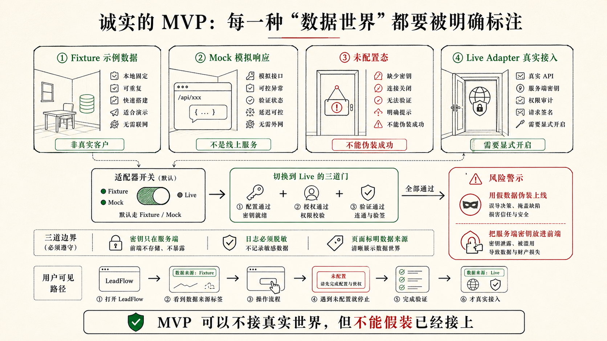

## 4.1 从 0 到 1：用 PRD 和 DESIGN 完成 LeadFlow MVP

第二章为 LeadFlow 写好了 `PRD.md` 和 `DESIGN.md`，第三章系统介绍了脚手架的各个层次。4.1 从这两份文件出发，先把 MVP 在本地跑起来。这里不是把第三章的脚手架撤回，而是先选择首轮开发真正需要的最小工程合同：目标、设计状态、长期规则、运行方式和验收边界先有落点，Skills、SubAgents、Rules、Hooks 和 MCP 等更厚的层次，等重复风险出现后再沉淀。

全章贯穿一条任务：AI 建议必须带来源，并且等待销售人工确认。4.1 的 MVP 不追求"把所有功能做齐"，而是先把这条最小价值链跑通：线索进来，沟通记录可查，AI 建议有来源，销售能确认或拒绝建议，建议在确认前保持草稿状态。后续 4.2 到 4.4 章节都围绕这条边界推进。

**写第一行代码之前，先确定用哪套脚手架。**

第一章的核心公式是 `Agent = Model + Harness`——模型提供生成能力，Harness 决定这次生成能不能被约束、可不可以被验证、能不能在下一轮继续。这套 Harness 在工程上落地为脚手架：核心文件记录产品边界、设计状态和长期规则；Skills 把可重复工作流封装成 Codex 可以按需加载的经验；TODO 和验收标准追踪任务进展和可观察结果。

没有脚手架，你做的是 Vibe Coding——Codex 可以很快生成页面，但每次对话结束后，上下文消失，决策不留痕，下一轮再进来的人或 AI 都要重新猜测边界。有了脚手架，每一轮开发的产品判断、设计约束、任务状态和验收结果都沉淀在项目里，成为下一轮的工程条件。

所以，**任何认真的项目，在第一次把任务交给 Codex 之前，都应该先确定自己的脚手架起点**。起点可以很小，但不能没有。没有脚手架，Codex 只能跟着当前提示猜；有了最小脚手架，它至少知道目标写在哪里、边界从哪里读、执行状态往哪里回写、验收结果用什么证据证明。

你可以从 [skills.sh](https://www.skills.sh/) 找到适合自己工作流的现成 Skills，比如项目冷启动、首版 MVP 开发、正式验收这类可重复工作流，或者直接用作者整理的 [CodeNow](https://github.com/xue160709/CodeNow) 脚手架里那套开箱即用的 Skills 组合；第五章会详细介绍它的完整设计思路。对于第四章的 LeadFlow，我们先不用一整套冷启动系统，而是使用一个足够现实的最小起点：

```text
PRD.md           说明 LeadFlow 第一版为什么做、做给谁、做什么、不做什么
DESIGN.md        说明用户如何看见客户事实、AI 建议、来源和人工确认
AGENTS.md        说明 Codex 的长期工作规则、数据边界和汇报要求
```

Codex 开始开发以后，可以再把任务拆进 `TODO.md`，把关键风险沉淀进 `ACCEPTANCE.md`，把可重复流程做成 Skills。这里的判断标准不是“文件越多越专业”，而是“本轮需要哪些约束，才能让 Codex 的行动可校准”。首轮 MVP 不需要一开始就拥有完整工具链，但至少要让目标、边界、规则和完成信号有稳定位置。

### 有文件和没有文件，Codex 的行为差在哪里

这个差别比“怎么写提示词”更根本。同样一句话：

```text
帮我完善 AI 建议卡片。
```

如果项目里没有 `PRD.md` 和 `DESIGN.md`，Codex 可能会按常见产品直觉行动：把“建议”写成系统结论，让按钮更像“发送给客户”，为了演示效果在组件里写死几条建议，甚至顺手预留真实 CRM 或邮件发送。它不是故意越界，而是没有可对照的项目事实，只能用通用模式补空白。

如果项目里已经有 `PRD.md`、`DESIGN.md` 和后续的 `ACCEPTANCE.md`，同一任务会被拉回 LeadFlow 的具体边界：

```text
PRD.md          不自动发送消息，不接真实 CRM，不处理真实客户数据
DESIGN.md       建议是待确认草稿，来源入口靠近正文
ACCEPTANCE.md   无沟通记录时不得生成通用建议，确认前不得进入已执行记录
```

这不表示 Codex 一定不会犯错。更准确地说，文件让错误变得可见：当它准备加发送按钮时，你能指出这违反 PRD；当它展示无来源建议时，你能指出这违反 ACCEPTANCE；当它把“待确认草稿”做成系统结论时，你能指出这违反 DESIGN。文件的价值不是让 Codex 瞬间变聪明，而是给人和 Codex 一个共同的事实来源。

### PRD 和 DESIGN ：对实现路径影响最大的一组文件

2.3 已经讲过 `PRD.md` 的职责和写法，2.4 已经讲过 `DESIGN.md` 的职责和写法，本节不重复。到了实战里，判断一份 PRD 是否够用，要看它能不能改变 Codex 的下一步行动。如果 Codex 读不读这份 PRD 都会写出差不多的页面，那它还不够具体。

PRD 对 LeadFlow 实现路径影响最大的一节是 `数据与 API 策略`。没有它，Codex 可能为了"完成 AI 建议"直接在前端写死几条建议，或者把 `VITE_OPENAI_API_KEY` 放进浏览器环境；有了它，fixture 数据、mock generator、server-side adapter 和未配置态各自的职责才能分清。

LeadFlow 的 `DESIGN.md` 里，AI 建议区需要专门覆盖状态链、建议卡片交互，以及 fixture / live / 未配置三种数据模式的界面表达——CRM 工具里，销售对 AI 建议的信任程度，直接取决于界面能否把"待确认草稿"和"客户事实"区分开来。

```md
## 组件

**AI 建议区状态**（CRM 工作台的核心状态链）
- 空态：无线索或无记录时引导，不显示假数据
- 加载态：骨架屏，布局不跳动
- 信息不足态（not_ready）：记录不足以生成建议，明确说明，不补通用话术
- 模拟态（mocked）：区域内显示「示例 AI 建议」标识
- 未配置态（live_unconfigured）：显示未配置提示，不展示任何建议内容
- 生成中（generating）：骨架屏保持建议区布局稳定
- 待确认态（draft）：草稿样式，带来源入口，视觉权重低于客户事实区
- 已确认 / 已拒绝态：与草稿态明确区分
- 错误态：明确提示 + 重试入口

**建议卡片交互**
- 主操作文案：「确认为跟进计划」，不写成「发送给客户」
- 次要操作：「编辑建议」「拒绝建议」「查看来源」
- 来源入口靠近建议正文，展开后显示关联沟通记录，不藏进 tooltip
- 确认前建议不得出现在「已执行跟进」时间线

**数据与演示**
- MVP 使用 FIXTURE 数据（`src/fixtures/`）；示例线索显示「示例数据」角标
- mock 模式下 AI 区域显示「示例 AI 建议，未调用真实模型」
- Key 未配置时显示「真实 AI 未配置，当前可使用示例建议预览流程」
- 真实 API 调用失败时展示失败状态和重试入口，不生成假建议兜底
```

### 先用脱敏示例数据跑通流程，再考虑真实接入

从 0 到 1 做 MVP，最容易犹豫的是：要不要一开始就接真实 AI 模型，要不要连真实 CRM，要不要上传真实客户数据。我的建议是先把这个问题拆开。

MVP 完全可以用开发者自己写好的一批脱敏示例数据来驱动页面——比如几条假线索、几条假沟通记录，AI 建议也用预先写好的示例返回，不真正调用 OpenAI 或任何模型。这不是偷懒，而是主动选择一个可控的开发世界：数据稳定、流程可重复、任何人打开都能复现同样的页面状态。

这时候需要想清楚四件事：
- 示例数据要单独存放，线索、沟通记录和来源标记都有稳定内容，每次运行结果一样，不依赖手动填写；
- 示例 AI 建议和未来真实 AI 建议要用同一套接口格式，这样等以后接入真实模型时，页面不需要重写；
- 如果未来需要真实 AI Key，Key 只能放在服务端读取，不能直接写进前端代码或暴露给浏览器；
- 项目里留一个 `.env.example` 文件，把需要配置的项写清楚，让后来的人知道真实模式需要什么。

你可以让 Codex 在开发时遵守四条规则：

```text
1. 默认用示例数据完成 MVP，不依赖真实外部服务。
2. 如果接入真实 AI，API Key 只能放在服务端环境变量中。
3. 没有配置 API Key 时，页面必须显示"未配置"状态，不能假装已经调用了真实模型。
4. 示例 AI 建议必须带来源标记，并且在页面上明确标识为"示例建议"。
```

这几条规则会让 MVP 更诚实。很多团队觉得用示例数据是"假的"，于是急着接真实 API；但真正危险的不是用示例数据，而是用了示例数据却没有说明——让页面看起来像在调用真实模型。一个清楚标识的示例世界，比一个半真半假的状态更适合 0 到 1：前者能让你验证信息架构、来源追溯、人工确认和各种失败状态；后者很容易把 Key 管理、权限、日志、隐私和不稳定的模型输出一起引入首版，让项目还没跑起来就被复杂度拖住。



### 把 PRD 和 DESIGN 交给 Codex

到这里，才轮到 Codex 写代码。这个顺序很重要：不是人把实现细节都规定完，而是人先把产品和设计边界放进项目，再让 Codex 自主选择实现路径。

你可以在项目根目录准备好 `PRD.md` 和 `DESIGN.md`，然后这样交给 Codex：

```text
我们要从 0 到 1 完成 LeadFlow MVP。

请先阅读根目录的 PRD.md 和 DESIGN.md。不要额外引入本轮用不到的复杂流程或外部脚手架。你可以根据当前项目状态创建最小可运行 Web App。

本轮目标：
1. 完成 LeadFlow MVP，可以在本地运行。
2. 使用 fixture/mock 数据展示线索列表、客户详情、沟通记录、AI 摘要、下一步建议、来源展开和人工确认。
3. 预留真实 LLM API 接入边界，但默认不依赖真实 API。
4. 没有 API Key 时必须显示未配置态，mock 建议必须标识为示例。
5. 不接真实 CRM，不处理真实客户敏感信息，不自动发送消息。

实现要求：
- 如果已有前端脚手架，沿用当前技术栈。
- 如果当前目录为空，请创建一个最小 React + TypeScript + Vite + Tailwind 项目。
- 把示例数据放在 fixtures 或等价目录。
- 把 mock suggestion 和未来 live suggestion 的接口分开。
- 添加 README，说明启动方式、mock/API 模式、已完成范围和未完成边界。

完成后请运行必要命令，例如 npm install、npm run dev、npm run build 或项目已有检查命令。最后汇报修改文件、启动方式、自检结果和未完成事项。
```

这个提示有几个设计点。第一，它要求 Codex 先读 `PRD.md` 和 `DESIGN.md`，而不是直接写代码。第二，它没有要求 Codex 使用某个特定脚手架，因为第四章要讲的是可迁移的工程委托方式，不是某个仓库的专属流程。第三，它明确 mock 和 API 的关系，避免 Codex 为了"更完整"直接接入真实外部服务。第四，它把 README 也列进交付物，因为 MVP 做出来以后，下一轮人和 Codex 都需要知道怎么运行、现在是什么模式、还有什么没有做。

如果 Codex 反过来问你"是否需要真实 API Key""是否要接真实 CRM""是否要加登录权限"，不要顺着它把范围越聊越大。用 PRD 里的边界回答它：

```text
本轮先不接真实 CRM，不做登录权限。
真实 LLM API 可以预留服务端接口，但默认使用 mock。
请优先完成 fixture/mock 模式下的完整 MVP，并把 live 未配置态做出来。
```

这就是人和 Codex 的分工。Codex 可以决定文件结构、组件拆分、状态管理和样式实现；人要守住产品边界、数据边界和风险承受度。

### MVP 跑起来之后

一个 MVP 做出来，产品从你脑子里的想象，变成了一个可以打开、可以点击、可以观察出问题的工程对象。你可以走通这条最小闭环：

```text
打开应用
-> 看到示例线索列表
-> 点击线索进入客户详情
-> 查看客户事实和沟通记录
-> 看到 AI 摘要和下一步建议
-> 展开建议来源
-> 确认、编辑或拒绝建议
-> 看到示例数据 / 未配置 / 失败 / 无记录等边界状态
```

项目里通常会包含这些东西：

- 一个可运行的本地 Web App。
- 一组脱敏示例线索和沟通记录。
- 线索列表、客户详情、沟通记录时间线。
- AI 摘要和下一步建议卡片，带来源展开。
- 建议的草稿、已确认、已拒绝、信息不足、未配置等显示状态，在页面上清楚区分。
- 示例 AI 建议在页面上明确标识为"示例"，不伪装成真实模型输出。
- 真实 AI 的预留接入位置，且 API Key 不出现在浏览器端代码里。
- README 说明如何运行、当前用的是示例数据还是真实模式、还有什么没做。

这里的"完成"是 MVP 意义上的完成。它不代表 LeadFlow 已经可以接入真实客户数据，也不代表 AI 建议已经具备生产级准确性，更不代表销售可以对客户自动发送消息。它代表的是：产品的最小价值链已经跑通，数据和边界是诚实的，用户能在一个可见界面里理解客户事实、AI 建议、来源和人工确认之间的关系。

### 项目完成后大致长什么样

完成后，项目目录可能长成这样：

```text
PRD.md
DESIGN.md
README.md
package.json
src/
  fixtures/
    leads.ts
  lib/
    ai/
      types.ts
      mockSuggestion.ts
      liveSuggestion.server.ts   # 如当前技术栈支持服务端
  components/
    LeadList.tsx
    LeadDetail.tsx
    CommunicationTimeline.tsx
    AiSuggestionCard.tsx
  App.tsx
```

这个结构只是示例，不是标准答案。如果你用 Next.js、Remix、SvelteKit 或已有公司脚手架，目录会不同。判断标准不变：PRD 说明目标和边界，DESIGN 说明界面状态，示例数据保证流程可复现，真实 AI 的接入位置在哪里预留，README 说明后来的人和 Codex 如何继续。
