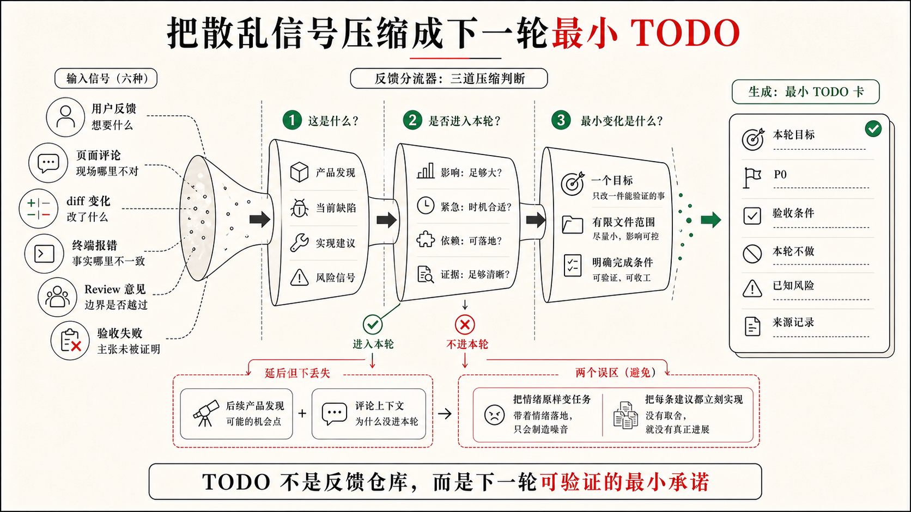

## 4.2 任务进入：从反馈、问题和评论进入下一轮 TODO

MVP 跑起来以后，反馈就来了。问题在于，反馈本身还不是任务。“AI 建议看起来太像结论”“卡片再高级一点”“顺便把邮件也发出去”，这些话有价值，但直接扔给 Codex，结果往往是功能越加越多、边界越来越散，哪些是当前必须修复的问题，哪些只是界面观感，没有人说得清。

本节要做的是任务进入：先把反馈整理成可以执行、可以验证、也可以拒绝的 `TODO.md` 条目，让 Codex 不再根据"感觉"继续写，而是对着清楚的任务边界动手。

为什么不直接把反馈说给 Codex？因为 Codex 会立刻开始实现，而没有人先判断这条反馈该改什么、改多少、是否属于当前 MVP。TODO 的作用不是增加流程，而是在实现之前，先让任务有一个可以被拒绝、可以被拆小、可以被验证的形式。没有这一步，反馈就直接变成代码，边界在不知不觉中改掉了。

### 反馈先不要急着实现

MVP 跑起来以后，读者最常遇到的第一类反馈通常很短：

```text
AI 建议看起来太像结论了。
```

这句话有价值，但它还不是一个工程任务。它可能意味着产品语义错了：AI 建议被写得像客户事实，而不是销售草稿。它也可能意味着设计状态不清楚：卡片没有把“待确认”显示出来。它还可能只是文案问题：建议标题叫“最佳下一步”，给人一种系统已经替销售做决定的感觉。三种解释对应不同修改范围，也对应不同验收方式。

如果直接让 Codex “优化一下 AI 建议”，它很可能会做出一组表面合理的改动：文案更销售化，按钮更醒目，甚至加一个“自动发送邮件”的动作。可这不一定解决问题，反而可能把 LeadFlow 的边界推坏。第二章已经说过，AI 建议在销售确认前只能是草稿，不能冒充客户事实，也不能自动对客户作出承诺。任务进入阶段，就是要把这种隐含边界重新拉到桌面上。

一个更好的进入方式，是先把反馈改写成判断问题：

```text
反馈：AI 建议看起来太像结论。

需要判断：
1. 是否把 AI 推测和客户事实混在了一起？
2. 是否缺少“待确认 / 草稿”状态？
3. 主按钮或标题是否暗示系统已经替销售做决定？
4. 是否需要同步更新 DESIGN.md 的状态表达或 ACCEPTANCE.md 的验收场景？
```

这一步的价值不在于放慢节奏，而在于防止开发跑偏。每条反馈进代码之前，先确认它该落的位置：是 PRD 的产品判断、DESIGN 的状态表达，还是 ACCEPTANCE 的验收场景。

### 任务来源不只来自聊天

在 Codex app 这样的工作环境里，下一轮任务有很多入口。聊天里的用户反馈只是其中一种，甚至不一定是最准确的一种。

第一种是用户直接反馈。比如你看完 LeadFlow 以后说：“这个建议卡片太像系统结论了，应该更像销售待确认的草稿。”这类反馈来自人的产品判断，通常需要先回到 PRD、DESIGN 或 ACCEPTANCE 看边界是否已经存在。如果边界已经写清楚，那它就是实现或设计表达没有做到；如果边界没有写清楚，那它不应该只改代码，还要补文档。

第二种是浏览器里的页面反馈。Codex app 的内置浏览器可以打开本地开发页面，页面上出现的问题不再只能靠口头描述。你可以围绕某个区域给出反馈，例如“这里的来源入口太弱，销售不会点开”，或者“这个未配置态看起来像错误崩溃，不像可预期的 API 未配置”。这类反馈的价值在于它绑定了具体界面位置，比“优化一下详情页”更容易变成可执行任务。

第三种是 diff 或 review 里的评论。Codex app 的 diff 面板显示当前项目或 worktree 的 Git diff，用户可以对具体改动留下行内评论，也可以按文件或修改块暂存或撤回。放到 LeadFlow 里，行内评论可能是：“这里把 mock 建议写死在组件里，会绕过 mock generator 和 sourceIds。”这种反馈不是产品感觉，而是针对具体实现边界的审查意见。

第四种是终端暴露的问题。内置终端绑定当前项目或 worktree，适合运行 `npm run dev`、`npm test`、`npm run build`、lint 或项目自带检查。终端错误不是噪音，它常常是下一轮任务的入口：类型检查失败说明数据模型和组件不一致，测试失败说明验收场景没有满足，dev server 起不来说明环境或依赖有问题。Codex 可以读取终端输出，把失败摘要带回下一步判断。

第五种是 `/review` 或人工审查发现的缺陷。`/review` 可以进入代码审查模式，检查未提交改动或和基准分支的差异。它不替代人的最终判断，但能帮你把“能跑”背后的风险显影出来：有没有行为回归，有没有缺少测试，有没有隐私字段进入日志，有没有把真实 CRM 接入悄悄拉进来。

第六种是 `TODO.md` 和 `ACCEPTANCE.md` 里的未完成项或失败场景。比如 4.1 的 MVP 已经把来源显示做出来了，但 `ACCEPTANCE.md` 里的“无沟通记录时不得生成通用建议”仍然失败。这个失败本身就是下一轮任务，不需要重新发明需求。

这些入口的共同点是：它们都不是代码本身，却都可以改变下一步开发。任务进入阶段要做的，就是把它们从“散落的信号”变成“可执行的任务”。



### 先判断它应该落到哪里

一条反馈进入项目以后，先不要问“要改哪个文件”，而要问它属于哪类变化。这个判断会决定 Codex 应该读取哪些上下文、更新哪些状态，以及本轮是否应该继续。

LeadFlow 的反馈可以用一张分流表判断落点：

表 4-1 LeadFlow 反馈分流对照表

| 反馈或问题 | 更像什么 | 应该先落到哪里 |
|---|---|---|
| “AI 建议太像客户事实” | 产品语义和设计状态问题 | `DESIGN.md`、`ACCEPTANCE.md`、本轮 `TODO.md` |
| “来源入口太隐蔽” | UI 交互和设计验收问题 | `DESIGN.md`、本轮 `TODO.md` |
| “没有沟通记录还生成建议” | 验收失败和实现缺陷 | `ACCEPTANCE.md`、本轮 `TODO.md` |
| “把建议自动发邮件给客户” | 可能改变产品范围 | `PRD.md` 待决策或后续 TODO，本轮通常拒绝 |
| “真实 CRM 数据也接进来” | 数据边界和权限变化 | `PRD.md`、`CONTEXT.md`、权限确认，通常另开任务 |
| `npm run build` 失败 | 工程缺陷 | 本轮 `TODO.md`，附终端失败摘要 |
| diff 中出现无关重构 | 范围漂移 | review comment、本轮 TODO 或要求回退 |

这个表不是流程规范，而是提醒：同样一句反馈，可能进入不同事实源。低风险文案可以直接成为小 TODO；涉及 AI 建议来源、销售确认、真实数据、权限和对外动作的反馈，必须先回到产品边界和验收场景；明显越过 MVP 非目标的请求，要敢于拒绝或延期。

Agentic Coding 里的“拒绝”不是对用户说不，而是把任务放回正确位置。比如“希望自动给客户发跟进邮件”是一个真实的产品想法，但它不属于当前 MVP。4.1 的 PRD 已经明确不自动发送邮件、短信或外呼。如果本轮顺手实现，LeadFlow 的责任边界就被一次反馈悄悄改写了。更合理的处理是：

```md
## 后续产品发现

- [ ] 评估“AI 建议转跟进邮件草稿”的产品范围
  - 来源：用户反馈希望自动给客户发邮件。
  - 当前判断：不进入本轮；不能自动发送。
  - 需要决策：是否只生成邮件草稿、是否需要审批、是否记录来源、是否接入真实邮箱。
```

这样做既没有丢掉用户想法，也没有让本轮任务越界。项目继续前进，但边界没有被偷偷改掉。

### 把反馈压成本轮最小变化

假设现在有三条反馈同时出现：

```text
1. AI 建议太像结论，销售容易误会已经可以执行。
2. 来源入口太弱，看不出建议来自哪条沟通记录。
3. 没有沟通记录的线索仍然显示了一条通用建议。
```

它们看起来都指向 AI 建议卡片，但不应该被写成“重做 AI 建议区域”。这个任务太大，容易把文案、状态、数据模型、设计系统、测试和布局全部卷进去；Codex 可能越改越多，人也很难 review。

更好的做法，是把它们压成一个本轮最小变化：

```text
本轮目标：修正 AI 建议卡片的可信边界。

最小变化：
1. 建议必须显示为待确认草稿，而不是客户事实或已执行结论。
2. 来源入口靠近建议正文，并能展开对应沟通记录。
3. 无沟通记录时显示信息不足状态，不生成通用建议。
```

这三个变化属于同一条可信边界，彼此有关，也足够小。它们会影响 UI、状态和生成逻辑，但不会引入真实 CRM、邮件发送、多角色权限或生产级模型接入。Codex 可以围绕它们读取 `DESIGN.md`、`ACCEPTANCE.md`、相关组件和测试，而不是把整个 LeadFlow 重新设计一遍。

落到 `TODO.md` 里，可以这样写：

```md
# TODO.md

## 本轮目标

修正 LeadFlow MVP 中 AI 建议卡片的可信边界：建议必须以待确认草稿呈现，来源入口可见，无沟通记录时不得生成通用建议。

## P0

- [ ] AI 建议以待确认草稿呈现
  - 来源：用户反馈“AI 建议太像结论”。
  - 设计：见 `DESIGN.md#AI 建议卡片状态`、`DESIGN.md#建议卡片交互`
  - 验收：见 `ACCEPTANCE.md#销售确认前不得标为已执行`
  - 完成条件：建议标题、状态徽标和主按钮都表达“待确认”，确认前不进入已执行记录。
  - 状态：未开始

- [ ] 来源入口靠近建议正文并可展开
  - 来源：浏览器反馈“来源入口太弱”。
  - 设计：见 `DESIGN.md#建议卡片交互`
  - 验收：见 `ACCEPTANCE.md#AI 建议必须显示来源`
  - 完成条件：每条建议能展开 sourceIds 对应沟通记录；来源缺失时不显示为可信建议。
  - 状态：未开始

- [ ] 无沟通记录时显示信息不足状态
  - 来源：验收失败“无记录线索仍显示通用建议”。
  - 验收：见 `ACCEPTANCE.md#沟通记录不足时不生成建议`
  - 完成条件：无记录 fixture 打开后不生成客户需求、预算判断或通用销售话术。
  - 状态：未开始

## 本轮不做

- 不接真实 CRM。
- 不自动发送邮件或消息。
- 不改变销售阶段判断模型。
- 不做句子级引用。
- 不引入新的 UI 框架或重做整体布局。

## 已知风险

- 如果当前 fixture 缺少 sourceIds，需要先补齐脱敏样例或明确来源替代字段。
- 如果现有组件把建议和已执行记录共用同一数据结构，可能需要先拆出 confirmationStatus。
```

这份 TODO 已经能改变 Codex 的执行方式。它给 Codex 划定了三条边界：任务是修正可信边界，不是美化卡片；改动范围是三个可观察结果，不是整张详情页；五件事明确放在本轮不做之外。

### 用评论保留上下文，而不是只保留情绪

评论的价值在于定位。一个好的页面评论或代码评论，能把人的判断绑定到具体对象上；一个坏的评论，只是把情绪换了一种写法。

在浏览器里看到 LeadFlow 页面时，你当然可以说“这里不对”。但更有用的评论是：

```text
AI 建议卡片标题叫“推荐行动”，会让销售误以为这是系统结论。
请改成待确认语义，并确认按钮文案不能暗示已经发送或执行。
```

这条评论包含了位置、问题、原因和边界。Codex 读到它以后，知道要检查卡片标题、状态和按钮文案，也知道不能把主操作写成“发送给客户”。它仍然可以自己决定具体实现，但不会误解任务方向。

diff 里的行内评论也一样。不要只写“这里不好”，而要指出它破坏了什么工程条件：

```text
这段 fallback 会在 sourceIds 为空时仍然展示建议。
这会违反 ACCEPTANCE.md 的“无来源不生成建议”场景。
请改成信息不足状态，并补对应 fixture 或测试。
```

这样的评论天然可以进入 TODO，因为它已经包含了验收指针和最小修复方向。它也能帮助 Codex 在修改时保持范围：修 fallback，不是重写整个建议系统。

### 终端错误也要翻译成任务

终端输出经常被当成临时故障：命令失败了，让 Codex 修一下。但在 Agentic Coding 里，失败输出也是项目状态的一部分。它告诉你当前世界和预期世界之间哪里对不上。

假设 4.1 之后运行 `npm run build`，出现这样的错误：

```text
Type error: Property 'sourceIds' is missing in type 'Suggestion'
```

这不是单纯的 TypeScript 麻烦。它说明项目里至少存在两套关于 AI 建议的数据理解：一套验收和 UI 要求建议带来源，另一套类型或 fixture 还没有这个字段。如果 Codex 只为了通过构建把 `sourceIds?: string[]` 改成可选，然后 UI 遇到缺失来源时仍然显示建议，构建会绿，产品边界却坏了。

所以，终端错误进入 TODO 时，不应该只写：

```md
- [ ] 修复 build 报错
```

更好的写法是：

```md
- [ ] 对齐 Suggestion 类型、fixture 和 UI 的来源字段
  - 来源：`npm run build` 失败，提示 `sourceIds` 缺失。
  - 背景：AI 建议必须保留来源；缺少来源时不能显示为可信建议。
  - 完成条件：类型、mock generator、fixture 和 UI 使用同一套来源字段；无来源时进入信息不足或来源缺失状态。
  - 验证：`npm run build`；有来源和无来源两个页面场景。
  - 状态：未开始
```

这就是把错误翻译成任务。命令失败给出的是症状，TODO 要记录的是工程状态该如何恢复。这样下一轮 Codex 不会为了“让命令通过”牺牲产品语义。

### `/status`、`/review` 和 worktree 是入口辅助，不是任务本身

工具命令也容易被误解。比如 `/status` 可以显示线程、上下文和限制信息；`/review` 可以进入代码审查模式；Local / Worktree / Cloud 模式可以决定任务在哪里运行，Worktree 还能把修改隔离在单独 Git worktree 里。这些能力很有用，但它们本身不是任务定义。

什么时候看 `/status`？当任务跑了很久、上下文变重、你担心 Codex 已经读了太多东西或需要切分任务时，它可以帮助你判断是否该收束当前轮，或者把剩余问题写进 TODO 后另开一轮。

什么时候用 `/review`？当 MVP 已经能跑、diff 也不小，你需要从“实现者视角”切到“审查者视角”时。`/review` 给出的反馈不应直接被全部实现，而要先分流：哪些是 P0 缺陷，哪些是后续改善，哪些和当前目标无关，哪些需要人判断风险。

什么时候开 worktree？当反馈可能需要探索，但你又不想污染当前稳定 MVP 时。比如“真实 CRM 同步可不可行”“AI 建议能否升级到邮件草稿”“是否要重构建议数据模型”，都可能适合放到隔离 worktree 里做 spike。但修一个明确的来源入口或无记录状态，不一定需要另开 worktree。工具选择仍然服务于任务风险，而不是为了显得流程高级。


### 让 Codex 帮你整理入口

任务进入不一定都要人手写。更实际的协作方式，是让 Codex 先读取反馈、页面评论、终端错误、diff comment 和已有 TODO，再帮你整理一版任务入口。人负责确认边界，Codex 负责把散落信号压成结构化 TODO。

可以这样发起：

```text
LeadFlow 现在要进入下一轮迭代。

请先读取 PRD.md、DESIGN.md、TODO.md、ACCEPTANCE.md，以及当前未提交 diff 和最近终端输出。

我会给你几条反馈：
1. AI 建议看起来太像结论，不像销售待确认草稿。
2. 来源入口太弱，用户不容易知道建议来自哪条沟通记录。
3. 无沟通记录的线索仍然显示通用建议。

请先不要改代码。先完成任务进入整理：
- 判断每条反馈属于产品范围、设计状态、实现缺陷、验收缺口、后续想法还是应拒绝范围。
- 给出本轮最小可交付目标。
- 更新或起草 TODO.md 中的本轮任务，包含来源、设计/验收指针、完成条件、本轮不做、已知风险。
- 如果需要更新 DESIGN.md 或 ACCEPTANCE.md，请说明原因并只给出最小修改建议。
```

这个提示的关键是“先不要改代码”。Codex 当然可以自行推进，但任务入口阶段要先产出下一轮执行地图。地图不清楚，后面执行越积极，偏得越远。

整理完成后，人要检查三件事：

1. 本轮目标是否真的最小。
2. 是否把超出本轮目标的想法挡在本轮之外。
3. 每个 TODO 是否有可观察完成条件和验收指针。

如果这三件事都清楚，才进入 4.3 的开发执行。

### 从 4.2 交棒给 4.3，至少要确认四件事

4.2 不是一节“如何写任务清单”的理论。它的产物是 LeadFlow 下一轮开发已经有了可执行入口。具体来说，至少要确认四件事。

第一，反馈来源被记录。它可能来自用户聊天、浏览器评论、diff 行内评论、终端错误、`/review` 结果，或者失败的 acceptance 场景。记录来源不是为了形式完整，而是为了让后来的人知道这项任务为什么出现。

第二，本轮目标是一个具体的状态变化。不要把“优化 AI 建议区域”写成一个大筐，而要定义出一个可以交付的结果，例如“修正 AI 建议卡片的可信边界：待确认草稿、来源展开、无记录不生成建议”。

第三，边界被写清。当前不做真实 CRM、不自动发送邮件、不做句子级引用、不重做整体布局，这些不是附带说明，而是保护本轮 diff 不失控的围栏。

第四，完成条件已经可检查。每个 TODO 至少要有设计或验收指针、可观察结果、最近失败或风险，以及需要运行或观察的证据类型。它不一定提前写成完整测试，但必须让 Codex 知道怎样算完成，怎样算不该继续。

到这里，LeadFlow 的开发 loop 才真正准备好进入实现。4.1 让产品从想法变成可运行 MVP；4.2 让反馈从散落信号变成下一轮 TODO。下一节才轮到 Codex 执行这些任务，但我们看的重点不是它点了哪个按钮、跑了哪条命令，而是命令反馈、页面状态和 diff 范围这三类信号是否证明它仍然走在本轮边界内。
