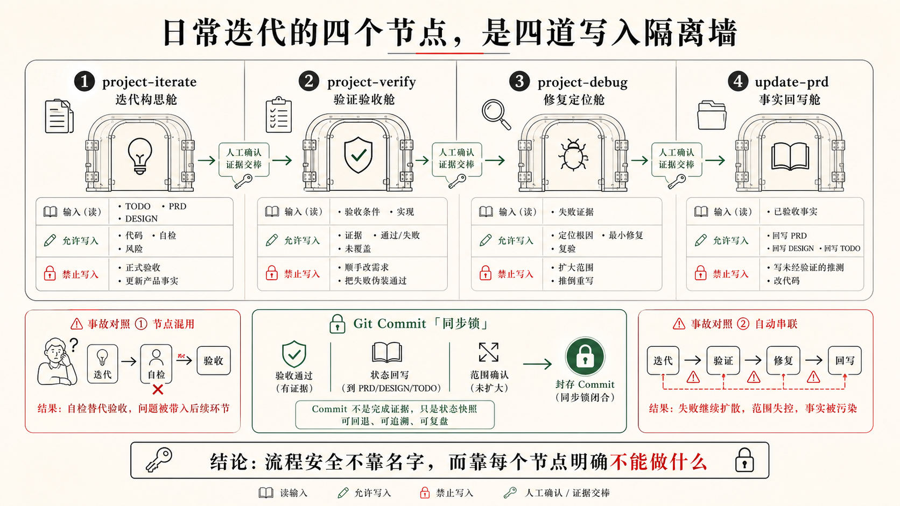
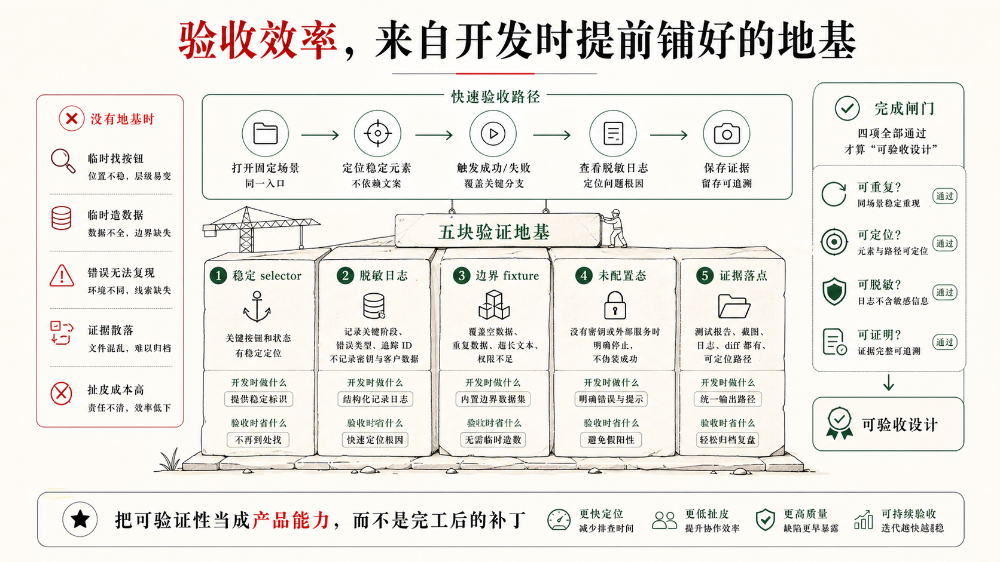

## 5.3 冷启动之后，日常迭代的四个节点是怎样分工的

上一节讲到，CodeNow 的冷启动设计是在约束 Codex 的写入权限：每个阶段只写自己有资格写的东西。这条逻辑不会在首版 MVP 跑起来之后就结束。真正的挑战在后面：项目有了代码、有了 TODO、有了验收契约，用户开始提持续的日常改动。这时候，如果没有对应的约束，Codex 在迭代中会系统性地混淆五件事：

```text
做了一点 / 做完了 / 自己检查通过了 / 正式验收通过了 / 文档已同步
```

每混淆一次，项目的可信状态就污染一处。TODO 的勾不再可信，acceptance 的状态戳不再可信，PRD 的描述不再可信。等你想知道"这个功能到底算不算完成"的时候，已经没有地方可以信任了。

CodeNow 的回答是把日常迭代拆成四个节点，每个节点有明确的能做什么，更重要的是有明确的**不能做什么**。

### 四个节点，四道隔离墙

```text
project-iterate
  读取 TODO 与 acceptance
  实现功能
  补 selector / 日志 / fixture / 未配置态
  做 Codex 自检
  回写必要进度

project-verify
  按 acceptance 逐条执行
  采集截图、日志、命令或测试证据
  回写状态戳与 TODO checkbox

project-debug
  验收失败时复现、采证、最小修复
  修完再回 project-verify 复验

update-prd
  按 git diff 识别代码变化范围
  把已实现能力写入 prd/<模块>/README 和 technical
  把差距和未完成项写回 TODO
```

设计四个节点不是为了让流程更复杂，而是为了让每个节点都不越权：

| 节点 | 明确不做的事 |
|---|---|
| `project-iterate` | 不给 acceptance 盖 ✅，不跑 update-prd |
| `project-verify` | 不修代码，不做调试 |
| `project-debug` | 不打 §2 checkbox，不把"修了"当"通过" |
| `update-prd` | 不把未实现的目标写成已实现能力 |



越权往往不是大动作，而是顺手发生的：iterate 顺手给 TODO 打勾，debug 顺手把修复标成通过，verify 顺手改几行代码，update-prd 顺手把意图写成事实。每一次"顺手"都在悄悄侵蚀可信度。侵蚀是隐蔽的——表面上进度在推进，实际上你已经不知道"完成"意味着什么了。

### 有顺序，但不自动链

四个节点之间没有自动调用——每次从一个节点切换到另一个，都需要用户或 Codex 明确发起。这同样是刻意设计的。如果 `project-iterate` 自检通过后自动触发 `project-verify`，"自检不能盖 ✅"这条规则就在工程上失效了——用户没有决策机会，就已经进入了正式验收。**什么时候"算完成了可以正式验"，是人的判断，不是 Codex 自己的判断。**

典型的日常迭代链路是这样走的：

```text
用户提需求
  → project-iterate（实现 + 自检）
      ↓ 用户看了觉得可以，说"验收一下"
  → project-verify（证据化验收）
      ↓ 某个场景失败
  → project-debug（复现 + 最小修复）
      ↓ 修完，回去复验
  → project-verify（再次验收该失败场景）
      ↓ 全通过，继续下一个 TODO
      ↓ 若干轮之后，TODO 变长 / 里程碑到了
  → update-prd（同步 as-built 文档）
```

整条链是"实现 → 人决策 → 验收 → 失败修复 → 复验 → 周期性归档"。

### `project-iterate`：在实现时就定好"做完是什么意思"

用户不会在开始之前主动想"做完是什么意思"——没有理由，也没有时机。功能跑起来，他认为完了。等到验收才发现：按钮没有稳定的定位方式，失败了只显示"请求失败"，没有 Key 的环境根本无法触发未配置态。验收变成了补债。

我把解法拆成两步：在实现之前替用户锁定"做完的定义"，然后在实现过程中把验收需要的入口顺手埋进代码。

第一步是锁定定义。`project-iterate` 动手前，先确认对应 `prd/<模块>/acceptance.md` 存在且有具体可执行的 GWT 场景。契约缺失时，它会 spawn `qa-acceptance-planner`——这个 Subagent 只做一件事：把功能规格转成 GIVEN/WHEN/THEN 场景，所有场景初始状态是 `⬜ 未实现`，没有权限写 TODO 或改代码。契约就绪，iterate 再开始。

第二步是预埋。有了可执行的场景，实现阶段顺手把验收需要的入口一起埋进代码：

- **稳定 selector**：acceptance 会触及的 UI 元素，优先语义选择器（role/label/accessible name），必要时加 `data-testid`。按钮文案一改测试就丢，同一页面两个"确认"自动化就懵——验收时才暴露就晚了。
- **脱敏日志**：API、IPC、第三方请求、降级逻辑，记录入口、参数摘要、成功/失败结果，不记录 Key 和隐私原文。失败时只看到"请求失败"、分不清是 401、超时还是结构变了，调试路就堵死了。
- **可复现状态**：空态、未配置态、错误态要能被主动触发。没有真实 Key，验收环境也能验证"未配置态行为正确"。
- **fixture 和测试入口**：边界条件和异常返回用集中 fixture 覆盖，不靠真实数据碰运气。



实现时，iterate 按改动类型渐进式加载参考资料：改 UI 才读设计系统，改 API 才读日志规范，改平台边界才读框架参考。做完功能后只做 Codex 自检，不给 acceptance 场景盖 ✅，不回写 TODO §2 checkbox。自检是"本轮改动基本正确"，不是"场景逐条通过留下证据"——用户不需要理解这个分层，他只需要在觉得可以了的时候说"验收一下"，系统自然走到下一个节点。

### `project-verify`：让"打勾"这个动作有可核查的含义

"我点了几下，好像没问题"——在用户体感上，这和通过验收是同一件事。没有证据，没有可追溯记录，TODO 的勾打上去之后没有人知道它代表什么。他也没有理由在意"能跑"和"按合同定义通过了"的区别——直到几轮之后出了问题，才发现根本不知道哪个状态是可信的。

所以我让"打勾"必须附带可追溯证据。`project-verify` 只在特定条件下触发——用户说"验收一下"、声明某个功能完成、准备发布，或触及高风险边界需要证据。触发后，它按 acceptance 场景逐条执行，把状态戳写回 `acceptance.md`，把 TODO checkbox 打勾。这是"打勾"的全部含义：不是"改了代码"，不是"smoke 没报错"，而是"按合同场景逐条通过，证据留在案"。

证据类型要标清楚：

```text
static         lint/test 命令输出，可回归
browser-smoke  一次性浏览器走查，不可回归
e2e-test       Playwright 测试，可回归
manual         必须人工确认
skipped        条件不足（如 API Key 不可用）
```

"一次走查"和"可以纳入 CI 的测试"是性质完全不同的东西，混在一起叫"已验收"，可信度会随时间衰减。跨多个模块时，verify 可以 fan-out 给多个 `acceptance-verifier` worker 并行执行——每个 worker 只验一个模块，独占端口和证据目录，回写状态戳后返回摘要；主会话 reduce，统一更新 TODO checkbox。对用户来说，说"验收一下"，系统在背后协调，他只看到结果。

### `project-debug`：先收束根因，再修复，而不是"改一下试试"

用户遇到问题，第一反应是"改一下试试"。改了一个地方，试一下；不行，再改另一个。改来改去，根因不明，最后不知道哪个改法有效，也不知道有没有顺手引入新问题。更麻烦的是：修完了，现象消失了，就把 TODO 打勾——但根因可能还在，只是暂时没触发。

我把 debug 的顺序强制反过来：先采证，再修复。`project-debug` 的流程是收束，不是发散：复现原失败路径 → 读 console/network/server 日志 → 定位最小可疑区域 → 最小修复 → 复验 → 回 `project-verify` 复验 acceptance。"改了"不等于"通过了"，debug 节点只负责找根因和修复，盖 ✅ 是回 verify 之后的事。

debug 按问题类型渐进式加载参考资料：描述模糊时先用三个问题对齐预期和实际；浏览器问题采集 console/network 证据；常见症状——页面空白、数据不变、登录失败——直接走对应 playbook；需要独立验证 API 或数据链路，写最小 TypeScript 验证脚本。

临时探针有自己的生命周期：修复后，纯为定位而加的噪声日志必须删掉；只有确认属于根因链路、有长期理解价值的日志，才整理成正式脱敏日志保留。

`project-iterate` 在实现时预埋的 selector、日志和 fixture，在这里发挥第二次价值：debug 可以沿验收路径直接复现，从日志里看清失败发生在哪层，再做最小修复。有埋点和没埋点，debug 的效率差距可以是十倍——这也是为什么实现时顺手埋，不只是为了验收方便，也是为了让失败不可怕。

### `update-prd`：让 Codex 下一轮进来时读到的是真实的项目状态

用户不维护文档——这是正常现象，不是他的问题。但文档不更新有一个他感知不到的后果：几轮迭代后，Codex 下一次进来读 PRD，读到的是三周前的状态。Codex 以为某个功能已经实现，其实那次迭代里被降级了；以为某个 API 字段还在，其实早改了。用户看不到这个"知识腐烂"在发生，但每一次 Codex 的判断都在基于越来越虚假的上下文，偏差越来越大。

我的做法是用 git diff 自动识别这段时间代码变了哪些范围，再增量更新对应模块的 as-built 描述。`update-prd` 从上次同步 commit 比到当前 HEAD（`git diff <lastPrdSyncCommit>...HEAD --stat`），先知道哪些文件变了，再按范围更新，不全量重写。上次同步的 commit SHA 存在 `prd/.update-prd-state.json` 里；不存在时改走全量扫描。需要同步三个以上模块时，fan-out 给多个 `prd-module-writer` worker 并行处理，主会话 reduce 后合并索引、把差距写回 TODO。

触发时机也是设计的一部分：不是每次 iterate 完就跑，而是在里程碑、首版收尾、大版本交付，或 TODO 过长需要归档时触一次。频率低，但每次同步的都是当前代码里真实存在的东西。三层文件的分工：

```text
prd.md / acceptance.md              = 意图与做完定义（开发前合同，不改）
prd/<模块>/README.md + technical    = 当前代码事实（as-built，update-prd 写这里）
TODO.md                             = 还需要做什么（差距写回这里）
```

未实现、部分实现、降级实现的内容写回 `TODO.md`，不包装成已完成。这和冷启动的逻辑一脉相承：文档必须等到有资格写的时候才能写。

### git commit 是这套流水线的同步锁

四个节点最终需要一个工程层面的同步锁：每一段确认的进展，应该落成一个 commit。这不只是代码管理习惯，而是 update-prd 能正常工作的前提。

update-prd 的核心机制依赖 `lastPrdSyncCommit`：它从上次同步 PRD 时的 commit 比到当前 HEAD，才知道"这段时间代码改了什么、要更新哪些模块文档"。如果长时间不 commit，这个 diff 窗口就会越来越大，update-prd 一次性要处理的变化范围会变得难以驾驭。如果 commit 粒度太混，一个 commit 里同时有代码改动、acceptance 状态戳和 PRD 更新，diff 就失去了语义，很难判断哪些变化是"功能实现"、哪些是"验证记录"、哪些是"文档同步"。

一个简单的 commit 分层习惯，可以让整条链路更清晰：

```text
feat: 实现 AI 建议展开来源功能      ← project-iterate 完成、自检通过后
verify: AI 建议模块 §2.3 验收通过   ← project-verify 打勾、回写状态戳后
fix: 修复建议确认状态写入错误        ← project-debug 修复并复验后
docs: 同步 AI 建议模块 as-built     ← update-prd 完成文档同步后
```

这样的分层让 git log 本身就能看出这段时间经历了哪些开发节点，而不是全混在一条"update various things"里。update-prd 读 diff 时，也能更准确地判断哪些变化是代码功能改动（需要更新 as-built 文档），哪些是验证证据或文档同步（不需要重新触发模块 PRD 更新）。

commit 的节拍可以这样理解：project-iterate 的 Codex 自检通过后，提交代码；project-verify 打勾并回写状态戳后，提交验证记录；project-debug 修复并复验后，提交修复；update-prd 完成文档同步后，提交 PRD 更新。不需要每个小步骤都 commit，但每个节点完成的边界处，commit 一次，是让后续节点有可靠基线的最简单方式。

git 在这套系统里不是事后备份，而是流水线的时间轴。同步点越清晰，四个节点之间的交接越可信。

### 设计自己的系统时，先抓五个维度

如果你不准备完整复制 CodeNow，也可以先把这一节的判断拿走：不要等验收时才思考怎么验。任何日常迭代系统都需要在五个维度保持可验收性。

第一，UI 主流程有没有稳定 selector。不是所有元素都要加 testid，但 acceptance 会点击、填写、选择或断言的元素必须可定位。第二，外部服务、storage、IPC 和 API 调用有没有脱敏日志。日志不需要多，但关键入口、成功、失败和降级要能看见。第三，数据来源有没有说清楚。真实数据、fixture、空态、未配置态和示例模式不能互相冒充。第四，证据有没有落点。截图、console 摘要、测试结果和验证 summary 应该有固定目录，而不是散在聊天里。第五，日常迭代和正式验收有没有分开，PRD 有没有随代码同步。平时自检要轻，正式验收要有证据，失败修复要回到验收复验，文档要跟着代码事实走。

这五个维度不会替你保证产品正确，但会显著降低"正确无法证明"的概率。对 Agentic Coding 来说，这是很大的变化：Codex 不只是写出一个看起来能用的功能，还在写代码时顺手为下一轮验证、debug 和协作留下可接住的结构。冷启动的约束在日常迭代里以这四个节点的形式延续下去。

下一节会继续往前看一层：如果这些动作要稳定发生，只靠 Skill 还不够。你还需要一个薄的 `AGENTS.md` 做入口路由，也需要 rules 把长期边界放到该出现的位置。
