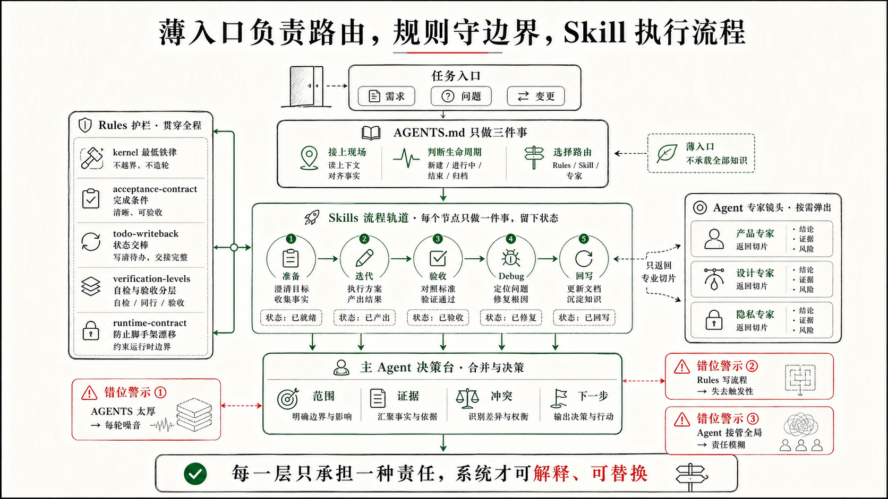

## 5.4 如何设计 `AGENTS.md` 和 rules

上一节讲完了日常迭代的四个节点，结尾提到一个悬而未决的问题：这些动作要稳定发生，只靠 Skill 还不够。`project-iterate` 必须先看验收契约、不能把自检当正式验收、要把进度写回 TODO——如果这些约束每次都靠用户提醒，CodeNow 并没有真正减轻他的负担，只是把写代码的压力换成了背流程的压力。

问题的根源在于：Skills 告诉 Codex 怎么执行一项任务，却不能告诉它现在该进入哪个 Skill，上一轮到哪里了，哪些约束每轮都必须保持。这两件事，Skills 都没有能力负责，需要另外两层来分别承担：

```text
Skills     → 怎么做一件事（执行方法）
rules      → 什么不能做、做到什么程度（持久边界）
AGENTS.md  → 现在在哪、该走哪条路（启动入口）
```



三层各司其职，才能让一个没有工程背景的用户，不靠记忆就能让系统维持健康状态。

在逐条展开之前，先分享一组设计每条 rule 时都会问的问题——这也是读这一节最有用的视角：

```text
如果没有这条 rule，项目状态会怎样失控？
它拦住哪种具体失控、保护哪个事实源？
哪些任务不适用，避免把轻量任务变重？
```

带着这组问题看 CodeNow 的 `AGENTS.md` 和七条 rules，就不再是看一组文件清单，而是看我在反复被同类问题绕过之后，做出的每一次设计选择。

### `AGENTS.md`：接上现场，走对路径

用户做完第一版 MVP，代码已经跑起来了，第二天他发了一条消息："继续做下一项。"

Codex 看到这句话，可以有五种完全不同的理解：继续昨天被打断的那项 TODO？做新开的下一个功能？修一个刚暴露的 bug？整理 PRD 文档？还是说项目还有什么准备工作没做完？如果没有任何上下文，Codex 的选择只能靠猜，或者从上一轮聊天记录里猜——而聊天记录可能早已被截断。

这就是 `AGENTS.md` 要解决的第一层问题：**让 Codex 知道这个项目现在在哪个位置，当前任务状态在哪里找。**

CodeNow 的 `AGENTS.md` 开头写了几件看起来很朴素的事：项目初始化后以根目录 `TODO.md` 为准；开始工作前按需读取 `TODO.md`、模块 `acceptance.md` 和 `design-system/DESIGN.md`；当前仓库以 `AGENTS.md` 与 `.codex/` 为主事实源；旧兼容目录是历史路径，不要新增引用；代码默认生成在仓库根目录，不要自动创建 `web/`、`client/`、`frontend/` 子目录。

这些不是装饰性说明，每一条都在拦一个真实发生过的错误。用户说"继续做下一项"，Codex 如果不先读 `TODO.md`，就不知道上一轮哪些任务完成了、哪些被阻塞、下一项应该从哪里恢复。没有指定子目录，Codex 凭习惯创建一个 `web/`，后面的启动命令、路径引用和文档说明就会全都绕一层。仓库里残留历史兼容路径，Codex 如果不知道主事实源在哪里，就可能把旧路径当成当前规范继续扩写。

第二层动机，是降低用户的表达成本。`只读评估`、`轻量维护`、`实现 TODO 第 x 项`、`正式验收/打勾`、`教学模式`——这些省话口令不是为了看起来像命令系统，而是让用户不用背完整流程。一个不懂 ATDD、不懂状态戳、不懂 `project-verify` 是什么的用户，也可以用"正式验收"表达清楚：这次不是普通自检，要按验收契约留证据。口令的本质是把专业意图压缩成日常语言。

第三层动机，是让路线在行动之前就可见。`路由判断：... → 使用 ...` 这行声明的价值不在于格式，而在于把 Codex 的判断放到修改发生之前。用户在代码改动之前就能看到：你现在把这件事当成冷启动、日常迭代、正式验收、debug，还是轻量维护？如果路线判断错了，人可以立刻拦住，而不是等返工时才发现走偏。

三层加在一起，`AGENTS.md` 做的事是：识别当前阶段、声明主事实源、读取 TODO 作为任务控制面、降低口令成本、暴露路由判断。细节都交给 rules 和 Skills 处理；`AGENTS.md` 只负责让每轮任务从正确的位置开始。

### `lifecycle.md`：同一句话在不同阶段是不同任务

有了 `AGENTS.md` 解决"接上现场"，还有一个问题没解决：各个 Skill 之间的边界由谁来说清楚？

如果每个 Skill 自己维护一份"我在什么时候用、什么时候改走别的路"，就会出现这种局面：`project-iterate` 说"根因不明的问题先去 debug"，`project-debug` 说"问题修完去 iterate"，`project-verify` 说"失败了去 debug 修"，`update-prd` 说"日常小改别来找我"。用户或 Codex 想确认"某件事该走哪条路"，需要把四个 Skill 的描述拼在一起才能读懂。某一天某个 Skill 的描述变了，其他 Skill 没有同步，路线图就漂移了。

`lifecycle.md` 作为唯一事实源解决这个问题。所有 Skill 涉及"与其他 Skill 的分工"时，引用这份规范而不是自己复述。路由表只有一份，每次调整只改一个地方。

这条规则同时解决另一个问题：同一句用户输入，在不同项目阶段对应的任务完全不同。

```text
"继续做"——还没有 prd.md：先让想法成形
"继续做"——有 prd.md 没有 TODO：先做项目准备
"继续做"——首版还没跑起来：进入 03 首版开发
"继续做"——已有代码和 TODO：才是 project-iterate
"继续做"——行为异常根因不明：先 project-debug
```

对新手来说，这种区分尤其重要——他不一定知道"现在还不能写代码"，不一定知道报错应该先复现采证而不是直接重写。生命周期规则把这些判断从用户的记忆里拿出来，让 Codex 按当前项目状态自动路由。

`lifecycle.md` 还管另一类边界：subagent 的写入隔离。主会话是唯一 orchestrator，叶子 worker 只写各自的物理文件范围，共享文件由主会话 reduce 阶段单写。并行执行可以提效，但不能变成"多个执行者同时改 TODO、PRD、acceptance"——共享状态只能有一个最终写入者。

### `kernel.md`：每轮都要进入上下文的最低铁律

有了路由，还有四件事比路由更基础——忘了不只是走错路，而是项目状态立刻变得不可靠。这四件事必须每轮都记得，但我又不想让 Codex 每轮读完所有 rules。

这就是 `kernel.md` 只保留四条常驻铁律的原因：

```text
改了产品行为或关键代码，要回写 TODO。
写 §2 功能前，先确认 acceptance 存在且具体。
本轮没做 TODO 回写或没补契约，最终回复要说明原因。
开始修改、开发、验收或同步前，先声明路由。
```

四条分别对应四种常见失控。

"代码变了，项目记忆没变"：本轮改完，下一轮 Codex 只看到旧 TODO，重复做、漏做，或把未完成当已完成；回写 TODO 是让项目状态从聊天里落回仓库。

"先写代码，再补完成标准"：acceptance 后补几乎必然变成描述既有行为，不再是开发前合同。

"沉默掩盖了没做的事"：没有回写 TODO、没有补契约，如果最终回复不说明，用户无法区分"刻意跳过"和"Codex 忘了"。

"任务还没开始，路线已经错了"：路由声明让错误在行动之前暴露，不是等代码改完才发现走偏。

`kernel.md` 不追求完整，只保留每轮都值得进入上下文的最低边界。其余细节按需加载——如果把所有规则都放进常驻层，规则会把 Codex 的上下文占满，真正该做的事反而被挤掉。

### `acceptance-contract.md`：把"做完"从感觉里拿出来

如果只能选一条最影响项目可信度的 rule，我会选 `acceptance-contract.md`。

新手项目里，"做完"最容易变成一种感觉。页面能打开，按钮能点，lint 也过了，于是很自然地说"完成了"。但一个实际的产品功能不是只看按钮能不能点。AI 建议有没有来源？沟通记录为空时会不会编造？没有 API Key 时会不会伪装成真实分析？销售确认前会不会进入已执行记录？这些才是功能真正能不能被接受的标准。如果这些标准没有在开发前写清楚，"完成"就只是那天 Codex 自我评估的结果。

`acceptance-contract.md` 的动机，是让完成标准先于代码出现，并且只在一处定义。CodeNow 规定 `prd/<模块>/acceptance.md` 是唯一验收事实源，TODO 只放任务和一行指针，`TESTING_CHECKLIST.md` 和 `test-results/` 只记录证据，模块 README 和 technical 只记录 as-built 事实——不复制验收清单。

这条规则拦住三种失控：**验收后补**（代码写完再写 acceptance，最容易把现有行为包装成标准，约束能力消失）；**标准多头**（TODO 一版、README 一版、测试清单一版，产品方向一变，多处复制的标准就开始漂移）；**自检盖章**（`project-iterate` 跑完 Codex 自检，不能把场景标成 `✅`；只有 `project-verify` 按场景执行并留下证据，才能写状态戳）。

这条 rule 同样写了什么时候不适用：只读评估、规则讨论、错别字、纯格式、小样式、不改变数据语义的内部重构，不应该被拉进 ATDD。好的规则不是把所有任务都变重，而是在真正会影响完成定义的地方变硬。

### `todo-writeback.md`：让下一轮不用翻聊天记录

很多人第一次用 AI 做项目时，会低估"聊天记录不是项目状态"这件事。本轮 Codex 知道自己做了什么，用户也知道，因为刚看完回复。可是换一个会话、过一天、改另一个模块以后，这些状态就开始模糊：哪个功能做完了？哪个只是部分完成？哪里被 API Key 阻塞？哪个验收失败还没修？如果只留在聊天里，项目很快就会失去连续性。

`todo-writeback.md` 解决的就是这种跨会话失忆。CodeNow 要求：完成或部分完成 checkbox、修改产品行为、API、平台能力、主流程、验证失败或跳过、发现新任务或规格差距——这些都要回写 TODO。核心不是"勤写文档"，而是让下一轮能恢复现场。

但这条 rule 同样写了什么时候可以不回写：只改错别字、纯文案、纯格式，只回答问题，只读评估，或本轮修改不对应任何开发计划变更。这一半同样重要。如果每个小动作都往 TODO 里塞记录，TODO 会从任务控制面变成流水账，新手打开以后更不知道下一步做什么。

这条 rule 想同时拦住两个方向相反的问题：一个是 silent drift，代码和 TODO 悄悄不一致；另一个是文档噪声，TODO 被低价值记录撑爆。把"必须写"和"可以不写但要说明"分清楚，才能让 TODO 始终只承载"还要做什么"。

### `verification-levels.md`：自检要轻，验收要硬

验证最容易出现两个极端。太松：跑过 lint，页面 smoke 一下，就说功能验收通过——TODO checkbox 很快失去可信度。太重：改一个文案也跑完整 build、全量测试、浏览器回归和正式验收——用户觉得脚手架笨重，最后什么都想绕过去。

`verification-levels.md` 的动机，是把验证从"跑得多不多"改成"语义清不清"。CodeNow 只暴露两类验证动作：

**Codex 自检**证明的是本轮改动在当前上下文里基本正确、未明显破坏相关入口。强度随风险伸缩：可以是 lint、类型检查、相关单测、局部 smoke 或动态走查，但默认不把 build、全量测试、浏览器回归和 `project-verify` 串成固定收尾。

**正式验收**证明的是某个功能按 `prd/<模块>/acceptance.md` 逐条通过，并留下可追溯证据。必须由 `project-verify` 执行，写状态戳、证据路径，并同步 TODO checkbox。

这条 rule 同时规定下界和上界。高风险主流程、API、安全边界不能只靠"我看起来可以"；但低风险规则维护、文案和小样式也不应该被过度验证拖住。这种区分同时守住两端：平时改动不会被重流程吓住，正式完成时有证据可以信任。

还有一个细节：`project-verify` 失败时不修 bug，只记录失败证据，交给 `project-debug` 复现和最小修复，修完再回验收复验。失败记录、修复动作、复验证据分开，"完成"才不会变成一句乐观判断。

### `runtime-contract.md`：脚手架自己也会漂移

前面几条 rule 管的是项目功能状态，`runtime-contract.md` 管的是脚手架自身。

CodeNow 不是一套永远不变的文件。它会迁移路径，删除旧目录，调整 subagent 格式，决定哪些东西应该复制到新项目、哪些只留在脚手架开发仓库。如果没有一条规则管这些，脚手架自己也会慢慢变成一团历史痕迹。

这条 rule 守住几个具体的漂移点：当前主路径是 `.codex/`，旧兼容目录只是历史路径；`AGENTS.md` 是主协作入口，其他运行环境需要的兼容镜像不能成为新的事实源；`.codex/agents` 的真实文件扩展名是 `.toml`，文档中不能把 subagent 继续描述成 Markdown；当前没有内置 `.codex/settings.json` 与 hook，不能假装这些机制仍然存在。

这些约束看起来像维护细节，但它们直接影响读者能不能复制 CodeNow。一个新手 clone 仓库，如果文档里一会儿说 `.codex/`，一会儿说旧路径，一会儿说有脚本门禁，仓库里却根本没有，他会立刻失去信心。

我也在自己的仓库里看到过这种漂移：`AGENTS.md` 里残留了对一个已删除速览文档的引用。问题本身不大，但它说明了一件事：rules 会腐烂，入口也会腐烂。`runtime-contract.md` 要求修改 `.codex/` 或 `AGENTS.md` 后，人工通读一遍，确认引用路径存在、规则和 Skill 不冲突、没有悬挂引用。这不是形式检查，而是维护脚手架自身的可信度。

这条 rule 还承认了一件事：当前没有机器门禁，一致性检查主要靠人工核对。不要把没有自动化的地方伪装成已经自动化；等复杂度上来，再引入脚本和 hook。

### `coach.md`：新手路径与执行流程分开走

最后一条 rule 最短，但体现了一个重要取舍。

CodeNow 的目标用户很多没有工程背景，所以需要一个教学模式。但教学和执行如果混在一起，每次开发、验收、PRD 同步都会变成冗长教程，真正要做的事被挤到后面。

`coach.md` 只有用户明确说"教学模式"、"一步一步讲"、"帮我理解为什么"，或自称零基础、看不懂代码，才按这条规则启用。启用后的原则是：先保护信心，术语先落地，只讲当前问题，给安全小实验。边界是：教学不改更多代码，解释和修改仍然遵守当前任务路由；用户只要结果时，先完成结果，再简短解释关键原因。

新手友好不是把所有流程都讲慢，而是在用户需要理解时有一条温和的入口；在用户只想完成任务时，不把解释变成新的负担。

### rules 的设计方法：先写失败，再写边界

把这七条 rules 放在一起，设计方法是共同的：不要先问"我要写哪些规则"，先问"如果没有这条规则，项目状态会怎样失控"。

```text
lifecycle.md            → 拦住走错阶段
kernel.md               → 留住最容易忘、忘了代价最大的动作
acceptance-contract.md  → 拦住完成标准漂移
todo-writeback.md       → 拦住跨会话失忆
verification-levels.md  → 拦住自检冒充验收，以及过度验证
runtime-contract.md     → 拦住脚手架自身漂移
coach.md                → 拦住教学和执行互相污染
```

每条 rule 对应一种反复发生过的失控，边界都包含两面：触发后必须做什么，以及哪些任务不适用。只有当某个问题会反复出现、会影响状态可信度、会让新手更难继续，才值得沉淀成 rule。一次性偏好放在任务说明里，当前进度放在 TODO 里，产品范围放在 PRD 里，完成标准放在 acceptance 里，流程步骤放在 Skill 里。

`AGENTS.md` 和 rules 不是为了把提示词写得更完整，而是为了把最容易失控的边界放到项目系统里——让一个没有工程背景的用户，不靠记忆就能让系统维持健康状态；让 Codex 每轮开始时都能读到当前最可信的事实，而不是在旧愿望、当前代码和聊天记录之间猜哪个才算数。这套逻辑不只适用于 AGENTS.md 和 rules，也适用于整套脚手架的设计——下一节把它展开到 Skills、SubAgents 和其他部件上。
